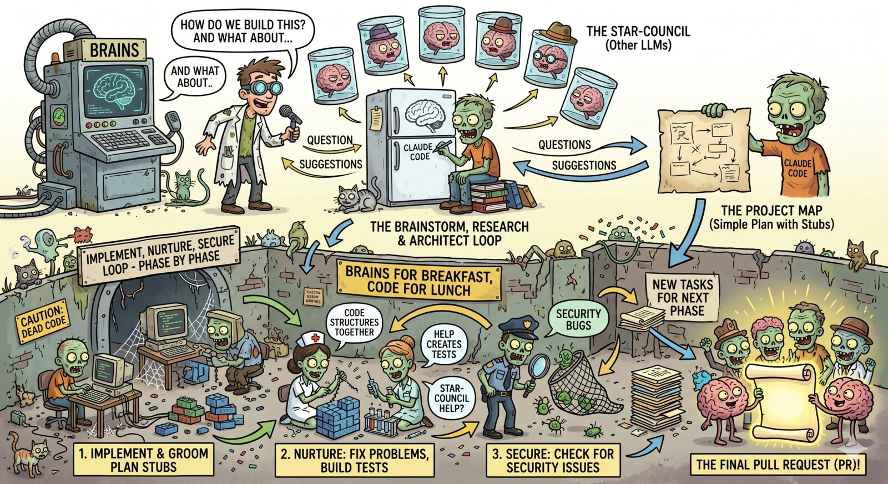

# BRAINS

**B**rainstorm **R**esearch **A**rchitect **I**mplement **N**urture **S**ecure



A structured, multi-LLM development workflow plugin for Claude Code. Guides complex tasks through a three-phase pipeline, with optional multi-model debate and review at each stage.

> **Why three phases, just-in-time grooming, and per-phase review?** See [**docs/why-brains.md**](docs/why-brains.md) for the design rationale — why forced brainstorming, sequential phases, focused teammate context, and star-chamber gating reduce token spend and rework compared to unstructured LLM coding.

## How It Works

BRAINS encodes a three-phase methodology for tackling complex software tasks:

1. **brains** — Phase 1: interactive research, question-driven questionnaire, and RFC 2119 ADR production with auto-generated architecture diagrams. Default mode: `--parallel` with star-chamber review.
2. **map** — Phase 2: high-level plan generation (stub-level, not implementation-specific), with beads-based task tracking using `brains:`-prefixed labels.
3. **implement** — Phase 3: launches a fresh Claude Code teammate per plan-phase via agent-teams (preferred) or tmux. Each teammate grooms its tasks, executes them with fresh subagents, then runs nurture and secure reviews.

Each phase chains into the next via a user-approval gate — or, with `--autopilot`, skips those gates and runs hands-off from phase 1 through phase 3, stopping only on a `brains:needs-human` escalation. The `nurture`, `secure`, and `diagram` skills remain user-invocable for standalone use on any codebase.

See [docs/diagrams.md](docs/diagrams.md) for rendered examples of the three diagram types (`flowchart`, `state`, `c4`) — including the pipeline itself as a flowchart and a C4 context diagram of the plugin's components.

## Prerequisites

**Required:**
- [Claude Code](https://docs.anthropic.com/en/docs/claude-code) — the plugin host

**Required for multi-LLM modes (parallel, debate):**
- [uv](https://docs.astral.sh/uv/) — Python package manager
- [star-chamber](https://pypi.org/project/star-chamber/) — multi-LLM council (PyPI, invoked via `uvx star-chamber`)
- Provider configuration at `~/.config/star-chamber/providers.json`

**Required for phase 3 (`/brains:implement`):** either
- [tmux](https://github.com/tmux/tmux) installed, OR
- Claude Code agent-teams enabled (`CLAUDE_CODE_EXPERIMENTAL_AGENT_TEAMS=1` in settings; Claude Code v2.1.32+)

**Strongly recommended:**
- [beads](https://github.com/gastownhall/beads) — authoritative task tracker. Falls back to `TaskCreate` / `TaskUpdate` (tmux mode) or agent-teams' built-in task list (agent-teams mode) with degraded functionality.

**Optional:**
- [Node.js](https://nodejs.org/) ≥ 18.19 — powers the BRAINS! visual companion server (phase 1) and the `mmdc` fallback renderer for `brains:diagram` (Mermaid types only).
- [podman](https://podman.io/) or [Docker](https://www.docker.com/) — required for `/brains:setup --with-kroki`, which runs a local `yuzutech/kroki` gateway paired with the `yuzutech/kroki-mermaid` companion on a user-defined network. This is the preferred diagram renderer and the *only* path that supports `--type c4` (Structurizr DSL); for Mermaid types, `brains:diagram` falls back to `mmdc` and then to source-only.

## Installation

**From GitHub:**

```bash
# 1. Register the marketplace (one-time)
claude plugin marketplace add --github Epiphytic/brains

# 2. Install the plugin
claude plugin install brains@brains-marketplace
```

**From a local clone:**

```bash
# 1. Register the marketplace (one-time)
claude plugin marketplace add /path/to/brains

# 2. Install the plugin
claude plugin install brains@brains-marketplace
```

After installing, run `/brains:setup --global` to install dependencies and configure LLM providers, then `/brains:setup --local` in each project for project-specific settings. Add `--with-kroki` to either invocation to pull and run a local Kroki container as the diagram renderer — undo later with `--without-kroki`.

```bash
/brains:setup --global                 # dependencies + providers + defaults
/brains:setup --local                  # per-project settings and directories
/brains:setup --with-kroki             # run yuzutech/kroki on 127.0.0.1 for diagram rendering
/brains:setup --with-kroki --port 8000 # pin Kroki to a specific port
/brains:setup --without-kroki          # stop and remove the local Kroki container
```

## Skills

| Skill | Command | Default Mode | Description |
|-------|---------|:---:|-------------|
| setup | `/brains:setup` | — | Install dependencies, configure LLM providers, set defaults, optionally run local Kroki |
| suggest | *(auto)* | — | Detects complex tasks and recommends BRAINS |
| brains | `/brains:brains` | parallel | Phase 1: research + questionnaire + ADR (with auto-diagram) |
| map | `/brains:map` | parallel | Phase 2: high-level plan + beads tasks |
| implement | `/brains:implement` | parallel | Phase 3: teammate-per-plan-phase execution |
| diagram | `/brains:diagram` | — | Generate Mermaid diagrams (`flowchart`/`state`/`c4`) — auto-triggered by `brains:brains` or invoked standalone |
| nurture | `/brains:nurture` | single | Review and refine (standalone or subagent) |
| secure | `/brains:secure` | single | Security review (standalone or subagent) |

## Modes

Most skills support three modes for LLM involvement:

| Mode | Flag | Behavior |
|------|------|----------|
| Single | `--single` | Local LLM only, no star-chamber |
| Parallel | `--parallel` | Work locally, then send to council for review |
| Debate | `--debate` | Multi-round deliberation across LLMs |

Additional flags:

- `--rounds N` — number of debate rounds (default: 2, requires `--debate`).
- `--autopilot` — orthogonal to mode; skips user gates and auto-chains phase 1 → 2 → 3. Star-chamber review still runs per selected mode and actionable feedback is auto-integrated; genuine architectural judgment calls surface as `brains:needs-human` tasks during phase 3. At the phase 1 ADR gate, `--autopilot` pre-selects *"accept ADR(s), push to origin, chain into `/brains:map --autopilot`"* (option 2 of 5). State is persisted in the plan header and honored by `/brains:implement --resume`.
- `--lean` — orthogonal to mode and to `--autopilot`; activates the token-efficiency path introduced in v0.3. Uses a compact protocol excerpt in place of the full `multi-llm-protocol.md`, summarizes the research document via a structured `Research-Summary` block in the plan header (ADRs are ALWAYS delivered whole — never summarized), splits the `/brains:implement` skill so teammates load only the teammate-side protocol, lazy-loads `failure-recovery.md`, and scopes star-chamber context per call type. Each role loads only what its manifest in [`manifests/`](manifests/) declares. Default is off — behavior without `--lean` is byte-identical to v0.2.x. `--lean` inherits through phase chaining. Expected savings: ~30–45% of structural overhead per `--parallel --autopilot --lean` run.
- `--teammate-model <sonnet|opus|haiku>` *(implement only)* — selects the model used to spawn per-phase teammate Claude Code instances AND their internal subagents (grooming, implementation, nurture, secure). When the orchestrator is Opus and this flag is absent, `/brains:implement` offers *"Spawn teammates using Sonnet to reduce cost? [Y/n]"* (default Y; auto-selected Y under `--autopilot`). Star-chamber invocations are unaffected. Sugar aliases `--teammate-opus`, `--teammate-sonnet`, `--teammate-haiku` are accepted (last one wins). The resolved tier is written into the plan header as `Teammate-model:` and read by `/brains:implement --resume`; a pre-flight summary (mode, autopilot, lean, orchestrator + teammate tier, escalation settings, phase/task counts) is displayed before any teammate is spawned — informational under `--autopilot`, `[Y/n]` confirm in interactive mode.
- `--no-escalate-on-retry` *(implement only)* — disable escalation-on-retry (which is **on by default** in v0.3). With escalation on, a task that fails twice on the teammate model is retried a third time on the orchestrator model before the `brains:needs-human` label is applied. The default is configurable via `settings.local.json` key `brains.escalateOnRetry` (boolean; default `true`); the CLI flag overrides the setting.
- `--ignore-model-hints` *(implement only)* — disregard `model-hint: prefer-opus` fields emitted by the grooming subagent. Without this flag, tasks flagged `prefer-opus` escalate to the orchestrator model for their implementation subagent even when a lower teammate tier is the default.

### Skip-to-implementation shortcut

At the phase-1 gate, if the synthesized architecture flags *no new external dependencies, no new external services, and a single-component change*, `/brains:brains` offers an additional acceptance option: **skip `/brains:map` and `/brains:implement`; implement the ADR inline in the current session**. `nurture` and `secure` subagents still run at the end. Autopilot never auto-selects this shortcut.

At the phase-2 gate, if the plan has *fewer than 10 total tasks, all in a single plan-phase, none flagged `risk:high`*, `/brains:map` offers a similar acceptance option to **skip the teammate spawn and implement inline**.

The shortcut saves the per-teammate structural overhead (roughly 7–12k tokens per teammate) for trivial changes where a full teammate spawn is overkill.

```bash
# Examples
/brains:brains "design a caching layer"                       # Uses default (parallel)
/brains:brains --single "design a caching layer"              # Local only
/brains:brains --debate --rounds 3 "design a caching layer"   # 3-round debate
/brains:brains --max-diagrams 3 "design a caching layer"      # Allow up to 3 auto-diagrams in the ADR
/brains:brains --diagram c4 "design a caching layer"          # Force a C4 context diagram
/brains:brains --no-diagram "design a caching layer"          # Suppress auto-diagram generation
/brains:map --parallel                                         # Phase 2 with parallel review
/brains:implement --parallel                                   # Phase 3 with parallel review
/brains:brains --autopilot "design a caching layer"           # Hands-off: phase 1 → 2 → 3
/brains:brains --autopilot --lean "design a caching layer"    # Hands-off + token-efficiency path
/brains:implement --teammate-sonnet                           # Sugar alias for --teammate-model sonnet
/brains:implement --teammate-model opus                       # Keep teammates on Opus (no downgrade)
/brains:implement --no-escalate-on-retry                      # Disable 3rd-retry-on-orchestrator
/brains:diagram "component flow" --type flowchart             # Standalone diagram, attaches to latest ADR
```

## Phase Outputs

| Phase | Output File | Additional |
|-------|-------------|------------|
| brains | `docs/plans/YYYY-MM-DD-<slug>-research.md` | ADRs in `docs/adr/` + auto-generated diagrams in `docs/adr/diagrams/` |
| map | `docs/plans/YYYY-MM-DD-<slug>-map.md` | beads tasks with `brains:` labels |
| implement | `docs/plans/YYYY-MM-DD-<slug>-phase-N-nurture.md`, `-phase-N-secure.md` per plan-phase | `docs/plans/<slug>-wrap-up.md` (or `-paused.md`) |

## Diagramming (v0.4+)

`brains:diagram` generates architecture diagrams from a natural-language description and stores the source + rendered SVG side-by-side under `docs/adr/diagrams/`. The source file is canonical; the `.svg` is a derived artifact that can be regenerated any time from the source.

| `--type` | Source language | Extension | Use for | Reserved for v0.5 |
|---|---|---|---|---|
| `flowchart` | Mermaid | `.mmd` | Processes, control flow, pipelines | |
| `state` | Mermaid | `.mmd` | Lifecycles, state machines, transitions | |
| `c4` | Structurizr DSL | `.dsl` | System context and container views | |
| — | — | — | — | `sequence`, `er` |

> **Two source languages, one skill.** Mermaid and Structurizr DSL are both rendered by the same local Kroki gateway — Mermaid via the `yuzutech/kroki-mermaid` companion container, Structurizr via the PlantUML/Structurizr engine bundled into the gateway image. The Structurizr switch for `--type c4` (v0.4.4) replaces Mermaid's experimental `C4Context` renderer, whose SVGs lacked fixed `height` attributes and rendered as broken images in GitHub.

**How it's invoked:**

- **Auto-triggered** by `/brains:brains` at ADR-write time. A heuristic picks up to `N` types (1–5, default 1) from the synthesized architecture and dispatches them. Disable per-run with `--no-diagram`; force a specific type with `--diagram <type>`; raise the cap with `--max-diagrams N`.
- **Standalone** via `/brains:diagram "<description>" [--type <type>]`. If `--type` is omitted, the skill infers from keywords (`state`/`lifecycle` → state; `system context`/`container` → c4; otherwise flowchart).

**Rendering priority** (first that answers wins — see [`skills/diagram/references/renderer-conventions.md`](skills/diagram/references/renderer-conventions.md) for the full contract):

1. **Local Kroki** — `~/.config/brains/renderer.json` with a `kroki_url` pointing at `localhost`, `127.0.0.1`, `::1`, or a `.local` domain. Enabled by `/brains:setup --with-kroki`. URL scheme is validated (http/https only) and non-local hosts are rejected (SSRF prevention — diagram source is never sent to arbitrary hosts on this path). The POST path depends on type: `/mermaid/svg` for `flowchart`/`state`, `/structurizr/svg` for `c4`.
2. **`mmdc` via `npx`** *(Mermaid types only)* — `npx -p @mermaid-js/mermaid-cli mmdc`. Requires Node.js ≥ 18.19. First run may download packages. Not applicable to `c4` — `mmdc` doesn't understand Structurizr DSL, so `c4` skips this step and goes straight to source-only if Kroki is unavailable.
3. **Source-only** — write source file (`.mmd` or `.dsl`), skip `.svg`, leave an HTML hint in the ADR explaining how to enable rendering.

The public `https://kroki.io` cloud service is **never** used as an automatic fallback. `--kroki-cloud` opts into it for a single standalone invocation only, with an interactive consent prompt; it is disallowed in auto-trigger mode.

**On-disk layout (example from this repo's own dogfooding):**

```
docs/adr/
├── 2026-04-23-002-brains-diagramming.md
└── diagrams/
    ├── 2026-04-23-002-brains-diagramming-flowchart.mmd
    ├── 2026-04-23-002-brains-diagramming-flowchart.svg
    ├── 2026-04-23-002-brains-diagramming-c4.dsl
    └── 2026-04-23-002-brains-diagramming-c4.svg
```

ADRs embed the rendered image and include the source in a `<details>` block, so the ADR stays readable in environments that don't render images.

See [**docs/diagrams.md**](docs/diagrams.md) for full rendered examples of all three types.

## Visual companion (BRAINS!)

Phase 1 includes an optional browser-based companion — a local SSE + WebSocket server that serves HTML fragments for mockups, side-by-side comparisons, Mermaid diagrams, and the final ADR at the gate. Offered once per session; usage is per-question, not per-session (text questions stay in the terminal).

Recent additions (v0.4):

- **BRAINS! rebrand** — header, title, and loader link back to this repository.
- **Live Mermaid rendering** — fragments can embed `<pre class="mermaid">` blocks; the frame renders them client-side via the Mermaid ESM CDN. Each block is wrapped in its own try/catch so a parse error on one diagram does not block the others.
- **ADR gate view** — at the phase-1 gate, ADR markdown is rendered in-browser via `marked` + DOMPurify (with Mermaid per-block) while the user evaluates the gate options.
- **Zombie working sprites** — `<div class="zombie-working" data-status="…">` animates three figures during processing (star-chamber, synthesis, ADR writing). Respects `prefers-reduced-motion`.
- **BRAINS.gif loader** — shown between page loads.
- **Configurable port** (v0.4.1) — default is a random ephemeral port (49152–65535). Override with `--port N` for a one-shot, or write `{"start_port": N}` to `~/.config/brains/companion.json` for a deterministic sequence (`N`, `N+1`, `N+2`, …, persisted in `$XDG_STATE_HOME/brains/companion-next-port.txt`). If a port is taken, the server retries up to 9 above it before exiting.

Full guide: [`skills/brains/references/visual-companion.md`](skills/brains/references/visual-companion.md).

## Plugin Structure

```
brains/
├── .claude-plugin/plugin.json
├── skills/
│   ├── setup/                 (install deps, providers, defaults, Kroki lifecycle)
│   ├── suggest/
│   ├── brains/                (phase 1 — research + questionnaire + ADR + auto-diagram)
│   │   ├── references/
│   │   │   └── visual-companion.md
│   │   └── scripts/           (BRAINS! companion server)
│   ├── map/                   (phase 2)
│   │   └── references/plan-format.md
│   ├── implement/             (phase 3 — per-plan-phase teammates)
│   ├── diagram/               (brains:diagram — Mermaid generation + rendering)
│   │   └── references/
│   │       ├── flowchart.md
│   │       ├── state.md
│   │       ├── c4.md
│   │       ├── renderer-conventions.md
│   │       └── storage-conventions.md
│   ├── nurture/
│   └── secure/
├── references/
│   ├── multi-llm-protocol.md
│   ├── multi-llm-protocol-compact.md   (compact excerpt for --lean)
│   ├── teammate-protocol.md
│   ├── beads-integration.md
│   └── failure-recovery.md
├── manifests/                  (per-role context manifests, loaded under --lean)
├── scripts/
│   └── manifest-lint.sh        (CI lint for manifest/skill drift)
├── docs/
│   ├── testing-humans.md
│   ├── testing-llm.md
│   ├── why-brains.md
│   ├── diagrams.md             (rendered examples of flowchart, state, c4)
│   ├── diagrams/               (source + SVG for the examples on diagrams.md)
│   ├── adr/                    (accepted ADRs; diagrams land in adr/diagrams/)
│   └── plans/
├── LICENSE
└── README.md
```

## Testing

- **Humans**: See [docs/testing-humans.md](docs/testing-humans.md) for a manual walkthrough
- **LLMs**: See [docs/testing-llm.md](docs/testing-llm.md) for a structured test protocol with pass/fail criteria

## Acknowledgments

Huge thanks to the projects BRAINS depends on, draws from, or was built on top of. None of this exists without them:

- **[superpowers](https://github.com/obra/superpowers)** by [obra](https://github.com/obra) — an agentic skills framework and software-development methodology that actually works. BRAINS was implemented using superpowers' `subagent-driven-development`, `writing-plans`, and `executing-plans` skills, and encodes many of the same ideas (brainstorm-before-code, explicit plan gates, TDD) as its own phases.
- **[beads](https://github.com/gastownhall/beads)** by [gastownhall](https://github.com/gastownhall) — a memory upgrade for coding agents. BRAINS uses beads as its authoritative task tracker: phase 2 creates `brains:`-labelled tasks, phase 3 teammates groom and close them, and failure state lives on the tasks themselves so work survives across sessions.
- **[star-chamber](https://github.com/peteski22/star-chamber)** by [peteski22](https://github.com/peteski22) — a multi-LLM council protocol SDK. Every `--parallel` and `--debate` in BRAINS is a `uvx star-chamber` call. The whole multi-LLM review model would be infeasible without it.
- **[agent-pragma](https://github.com/peteski22/agent-pragma)** by [peteski22](https://github.com/peteski22) — pragma directives for Claude Code. Inspiration for several of the conventions BRAINS uses in its skill and review flows.
- **[tmux](https://github.com/tmux/tmux)** — the terminal multiplexer. Phase 3's "teammate Claude Code instance per plan-phase" works by opening a `tmux split-window` when agent-teams isn't available. Still the reliable fallback after decades.
- **[Claude Code](https://docs.anthropic.com/en/docs/claude-code)** by Anthropic — the plugin host. Plugins, skills, agent-teams, and the subagent tooling are what make a workflow framework like this expressible in the first place.
- **[uv](https://github.com/astral-sh/uv)** by [Astral](https://astral.sh/) — the fast Python package manager. `uvx star-chamber` is the one-line onramp to the whole multi-LLM side of BRAINS.

Kudos to all the authors and maintainers. If you use BRAINS, please consider giving these upstream projects a star.

## License

[MIT](LICENSE)
