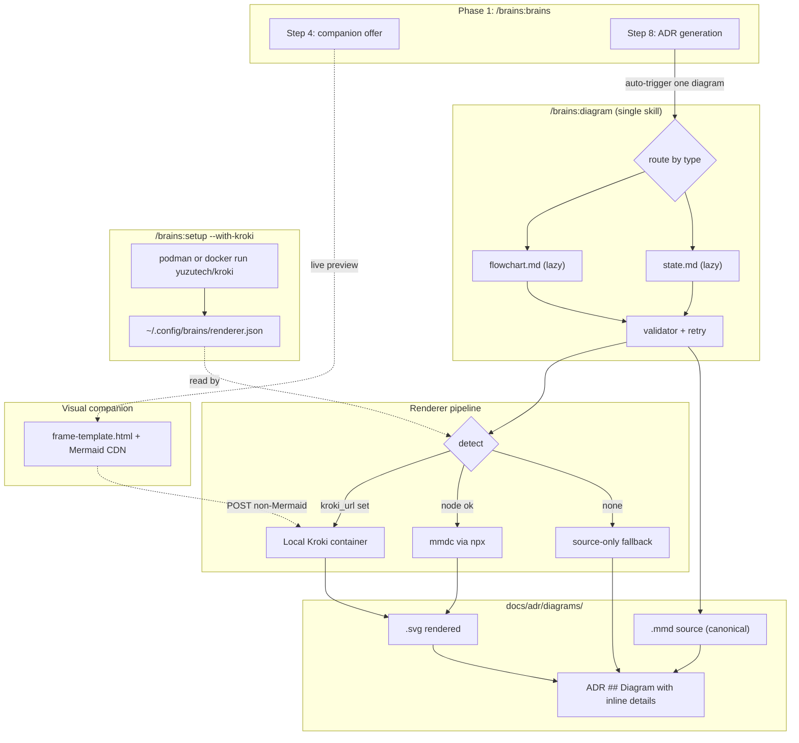

# ADR-002: BRAINS Diagramming Feature

**Date:** 2026-04-23
**Status:** Accepted
**Decision makers:** liam.helmer@gmail.com + star-chamber (3 OpenAI providers, 1 failed auth, 1 request timeout)
**Revision:** 2 — user-provided fixes applied 2026-04-23 (C4 moved to v0.4; `--max-diagrams` flag added; visual companion rebrand and enhancements)

## Context

BRAINS produces ADRs with architectural decisions but has no first-class support for generating diagrams that visualize component relationships, state machines, or entity models. The existing ADR template mentions Mermaid placeholder blocks but nothing generates them, and the browser-based visual companion (phase 1 step 4) has no diagram-rendering capability. The user asked for (a) auto-generated component/relationship diagrams as part of ADR creation, (b) diagram source stored alongside rendered SVG (default output format), and (c) the visual companion to produce these visuals live during brainstorming. The implementation must respect BRAINS v0.3's token-efficiency ethos (lazy-on-demand references in the phase-1 manifest), avoid mandatory heavy install (no JVM, no Puppeteer-Chromium as a hard requirement), and not exfiltrate internal architecture source to third-party cloud services by default.

The reference skill the user named — `tirandagan/claude-diagrams` (MIT, 2 commits March 2026, 1 star) — is a proof-of-concept that delegates rendering to the Kroki.io cloud. Its storage convention (source + SVG + rationale `.md` side-by-side) is worth adopting. Its Kroki.io default is not; Kroki.io publishes no privacy or data-retention statement, which is unacceptable for a marketplace plugin's default behavior.

## Decision

BRAINS ships a single new skill — `brains:diagram` — with per-type guidance in lazy-on-demand reference files (`flowchart.md`, `state.md`, `c4.md`, and later `sequence.md`, `er.md`). Mermaid is the canonical diagram source language. The `## Diagram` section of ADRs auto-populates via the skill when a heuristic fires, writing source `.mmd` and rendered `.svg` side-by-side in `docs/adr/diagrams/` and keeping an inline Mermaid `
` block in the ADR as a GitHub-native fallback. ADRs default to at most one auto-generated diagram; the user may opt into multiple via `--max-diagrams N`. The visual companion's `frame-template.html` gains a Mermaid ESM CDN import so `<pre class="mermaid">` fragments render live in the browser during brainstorming with zero toolchain, is rebranded to "BRAINS!" with a link to the plugin repository, displays the plugin's animated BRAINS gif as a loader between fragments, and shows zombie-themed working sprites on screens where Claude is processing. At phase-1 completion, the companion renders the accepted ADR(s) in a scrollable view. A new optional step in `brains:setup` pulls and runs the official `yuzutech/kroki` container via podman (preferred) or docker, writing the URL to `~/.config/brains/renderer.json`; when configured, this local container becomes the primary renderer, with `mmdc` via npx as the second preference and source-only as the graceful fallback. The skill retries invalid Mermaid once before falling back to a placeholder diagram, and regenerates diagrams on ADR revision. Phase 1 ships with flowchart, state, and C4 types in v0.4; sequence and ER follow in v0.5.

## Requirements (RFC 2119)

### Source and storage
- The system MUST store Mermaid source as `docs/adr/diagrams/<adr-filename-stem>-<type>.mmd` alongside the ADR that references it.
- The system MUST, when a renderer produces valid SVG, store the rendered output as `docs/adr/diagrams/<adr-filename-stem>-<type>.svg`.
- The system MUST treat the `.mmd` source as canonical; the `.svg` is a derived artifact that MAY be regenerated at any time.
- The ADR `## Diagram` section MUST reference the SVG by relative path (``) when SVG exists, AND MUST contain a collapsed `

Mermaid source
` block with the inline Mermaid source regardless.
- When no renderer is available, the system MUST omit the SVG image reference, retain the inline `
` block, and emit a one-line HTML comment hint indicating how to enable rendering.

### Renderer priority
- The system MUST check for a configured local Kroki container first (`~/.config/brains/renderer.json` with `kroki_url` field) and use it when present.
- When no local Kroki is configured, the system SHOULD attempt `mmdc` via `npx -p @mermaid-js/mermaid-cli mmdc` as the secondary renderer.
- The system MUST fall back to source-only (inline `
` block in ADR, no SVG file written) when both preferred renderers are unavailable or fail.
- The system MUST NOT send diagram source to any external cloud service by default.
- The user MAY opt into the public kroki.io cloud via an explicit `--kroki-cloud` flag; this MUST require explicit consent each invocation and MUST NOT be used as an automatic fallback.

### Skill structure
- The system MUST ship exactly one new top-level skill: `brains:diagram`.
- The `brains:diagram` skill MUST route to the correct per-type reference file based on the diagram type requested (`flowchart`, `state`, `c4`, and in v0.5 `sequence`, `er`).
- Per-type reference files MUST be declared `lazy-on-demand` in the phase-1 role manifest and MUST NOT be loaded unless a diagram is actually being generated.
- The skill MUST be invokable standalone as `/brains:diagram "<description>" [--type <type>]` for ad-hoc diagram generation outside the ADR flow.
- In v0.4, the system MUST ship `flowchart.md`, `state.md`, and `c4.md`. In v0.5, the system SHOULD add `sequence.md` and `er.md`.

### Auto-trigger during ADR generation
- Phase-1 step 8 MUST evaluate the synthesized architecture against the following heuristics and auto-invoke `brains:diagram` when exactly one of them fires. If multiple heuristics fire, the system MUST select only the highest-priority match (state > ER > flowchart):
  1. `state` — the decision describes at least one state machine or lifecycle with at least two transitions.
  2. `er` — the decision describes at least two entities with at least one relationship between them.
  3. `flowchart` — the decision names at least three components with at least two relationships.
- The system MUST default to at most one auto-triggered diagram per ADR.
- The user MAY override the cap via `--max-diagrams N` where N is bounded to 1-5. When N > 1, the system MUST generate at most one diagram per firing heuristic (no duplicate types) and MUST preserve priority order (state > ER > flowchart > C4 > sequence) when fewer triggers fire than the cap allows.
- The user MAY override auto-triggering via `--no-diagram` (suppresses all) or `--diagram <type>` (forces a specific type and overrides `--max-diagrams`).

### Self-correction and regeneration
- When the renderer reports a syntax error, the system MUST retry once with the error message appended to the generation context.
- If the second attempt also fails, the system MUST write a minimal placeholder diagram (a single-node `flowchart TD` block) to source and emit a comment noting manual revision is required.
- When phase 1's option 5 (user-provided fixes) triggers a re-run of architecture synthesis, the system MUST regenerate any existing auto-triggered diagrams from the updated architecture.
- Regeneration MUST overwrite both `.mmd` source and `.svg` output atomically. The system MUST NOT leave orphan derived artifacts.

### Visual companion integration
- `skills/brains/scripts/frame-template.html` MUST include a Mermaid ESM import from `https://cdn.jsdelivr.net/npm/mermaid@11/dist/mermaid.esm.min.mjs` in `<head>`, initialized with `{ startOnLoad: true }` and theme matched to `prefers-color-scheme`.
- HTML fragments served by the visual companion MAY contain `<pre class="mermaid">...source...</pre>` blocks; these MUST render live client-side.
- The phase-1 step 4 companion-offer text MUST be extended to explicitly mention architecture diagrams.
- The visual companion SHOULD, when a local Kroki container is configured, POST non-Mermaid DSL source to `${kroki_url}/{dsl}/svg` and embed the returned SVG inline. This path is strictly opt-in via the configured container.

### Visual companion rebrand and loading UX
- The frame header MUST display the text "BRAINS!" (exclamation included) in place of the current "Superpowers Brainstorming" text.
- The "BRAINS!" header MUST be an `<a>` linking to `https://github.com/Epiphytic/brains` (opens in a new tab with `rel="noopener"`).
- The frame-template page title (`<title>` element) MUST be "BRAINS!".
- The server MUST serve a static asset `skills/brains/scripts/assets/BRAINS.gif` (copied from a user-supplied source at implementation time; e.g., `~/Downloads/BRAINS.gif`). The asset MUST be committed to the plugin, not fetched at runtime.
- When the visual companion is waiting for the next fragment from Claude (between-page loading state), the frame MUST display the `BRAINS.gif` asset as a full-width loader overlay with a short progress message.
- Any screen that represents Claude processing (architecture synthesis, star-chamber review, ADR writing) MUST include zombie-themed working sprites — CSS or inline SVG animations of zombie figures that appear to be working — accompanied by a one-line status message describing the task in progress.
- Zombie sprite assets MUST be vendored inline (SVG in `frame-template.html` or as dedicated CSS animations). They MUST NOT load from external CDNs.

### Phase-1 ADR display in visual companion
- When the visual companion is active and phase 1 reaches the user gate (step 9), the companion MUST render the generated ADR(s) in a scrollable view with Markdown rendering and inline Mermaid rendering of any `## Diagram` blocks.
- The ADR view MUST show the filename, title, status, and full body of each ADR produced in this phase-1 run.
- The ADR view MUST remain readable (not replaced with a waiting screen) while the user decides among gate options 1-5.

### Security, performance, and accessibility (revision-2 tightening)
- The Markdown renderer MUST sanitize output before inserting into the DOM. The implementation MUST use `DOMPurify` (vendored) or an equivalent HTML sanitizer. Raw `marked` output MUST NOT be passed directly to `innerHTML`.
- Each inline Mermaid block in the ADR view MUST be rendered inside a try/catch; a parse failure on one block MUST NOT halt rendering of the rest of the ADR. Failed blocks MUST display the source in a `<pre>` with a red-bordered error message.
- `server.cjs` MUST include `image/gif` in its MIME type map and SHOULD include a long-lived `Cache-Control` header for assets under `scripts/assets/`.
- The committed `BRAINS.gif` asset SHOULD be optimized to under 1.5 MB (target; original is 3.6 MB). Optimization MAY use `gifsicle -O3 --lossy=80` or equivalent. If optimization below 1.5 MB is not achievable without unacceptable quality loss, the asset MAY exceed the target with a one-line justification in the commit message.
- All CSS and SVG animations introduced by this feature (zombie sprites, gif loader, Mermaid rendering transitions) MUST respect `@media (prefers-reduced-motion: reduce)` by disabling or reducing motion.
- Zombie sprite assets MUST be either hand-authored inline SVG/CSS OR sourced from a permissively-licensed asset (CC0, MIT, or public domain). Sourcing from random image packs without license verification is prohibited.
- Any animated "working" indicator (gif loader, zombie sprite) MUST be paired with a one-line text status describing the operation in progress — the animation alone is not a sufficient affordance.

### Kroki container setup (optional)
- `brains:setup` MUST support a new optional step invoked as `/brains:setup --with-kroki`.
- The setup step MUST detect `podman` first and fall back to `docker`; if neither is present it MUST report an error and exit non-zero without modifying system state.
- The setup step MUST pull the `yuzutech/kroki` image, run the container with a user-configurable port (default 8000) and restart-unless-stopped policy.
- The setup step MUST write `~/.config/brains/renderer.json` with `kroki_url`, `kroki_runtime` (podman or docker), and `kroki_started_at` (ISO-8601) fields.
- The reverse operation `/brains:setup --without-kroki` MUST stop and remove the container and MUST delete the Kroki entries from `renderer.json`.
- The system MUST NOT modify `renderer.json` outside these two explicit user actions.

### Token efficiency
- Each per-type reference file MUST remain under 3 KB.
- The `brains:diagram` SKILL.md MUST remain under 4 KB.
- The skill's references MUST be declared `lazy-on-demand` so they contribute zero tokens on runs that do not generate diagrams.
- The phase-1 `brains` SKILL.md MUST grow by no more than 40 lines net to accommodate the step 4 offer change and step 8 auto-trigger dispatch.

## Rationale

**Single skill over per-type subskills.** The initial proposal had five per-type subskills (flowchart, sequence, state, ER, C4) plus a router. Star-chamber review flagged this as scope creep: five skills create maintenance burden, the type boundaries blur in practice (state/flowchart hybrids are common), and the subskill dispatch adds a layer that provides no context savings beyond what lazy-on-demand references already give. A single skill with lazy per-type references centralizes validation, retry logic, renderer selection, naming, and fallback behavior — all of which would otherwise be duplicated across five skills. Users still get a single standalone slash command (`/brains:diagram`) and type discovery via `--type <name>`.

**Mermaid as canonical DSL.** The existing ADR template already uses Mermaid. GitHub renders Mermaid natively in Markdown (since 2022), so the inline `
` block is always readable without any toolchain. Claude's Mermaid output quality is the highest of any DSL per the research. D2 and Graphviz remain available via opt-in flags but are not the default.

**Local Kroki first, mmdc second, source-only fallback.** Star-chamber review correctly identified that `mmdc` has known Puppeteer friction (Chromium version mismatches, ARM macOS failures, Linux sandbox issues). A user who has completed `/brains:setup --with-kroki` has signaled they want reliable rendering; the local container delivers that for every DSL Kroki supports without any of mmdc's environmental issues. Users who skip Kroki setup get `mmdc` as their best-effort Mermaid-only path, and users for whom that also fails get a readable ADR via inline GitHub rendering.

**No cloud Kroki by default.** Kroki.io publishes no privacy statement; internal architecture descriptions must not be sent to an uncontrolled third party. The local containerized Kroki (same image, run in the user's own environment) provides Kroki's coverage without the privacy cost.

**Side-by-side storage with inline fallback.** The externalized `.mmd` + `.svg` pair satisfies the user's explicit requirement and gives the star-chamber a text-reviewable source file. The inline `
` block ensures ADRs remain complete and readable even when the SVG file is missing, moved, or the renderer was unavailable at generation time.

**Cap at 1 auto-diagram per ADR.** Star-chamber flagged that triggering up to three subagents per ADR would cause significant token bloat and slow ADR generation. One diagram is enough for a single architectural decision; multi-diagram decisions are a code smell suggesting the ADR itself should be split.

**Phased rollout.** Shipping flowchart, state, and C4 in v0.4 lets the renderer pipeline, auto-trigger heuristic, and retry/fallback logic stabilize against the three most common architecture-diagram cases before expanding coverage. The user explicitly requested C4 in v0.4 to support high-level system-context diagramming in the first release. Sequence and ER are additive — dropping a new reference file into `skills/diagram/references/` and extending the router table in v0.5.

**`--max-diagrams` override.** The default cap of one diagram per ADR protects against token bloat and keeps auto-generation predictable. The override exists because some architectural decisions are genuinely multi-faceted (a state machine that also introduces new entities benefits from both a state and ER diagram). Bounding the override to 1-5 prevents runaway generation while accepting that an expert user with a genuinely complex ADR can opt in.

**Visual companion rebrand and loading UX.** The frame header is rebranded from "Superpowers Brainstorming" to "BRAINS!" with a link to the plugin repository, matching the plugin's identity. Inter-fragment loading displays the plugin's animated `BRAINS.gif` to give the user a visual cue that Claude is working. Screens representing longer-running processing steps show zombie-themed working sprites — both a thematic fit (BRAINS!) and a clearer signal than a static "Connected" indicator that computation is in progress. Assets are vendored to avoid runtime fetches from external CDNs, in line with the no-default-cloud constraint.

**ADR display in companion.** Rendering the accepted ADR in the visual companion at the phase-1 gate gives the user a visually-formatted review view (Markdown + live Mermaid) alongside the terminal's gate prompt. This is strictly a viewer — the user still answers the gate in the terminal.

## Alternatives Considered

### Per-type subskills (5 skills + router)
- Pros: most context-efficient per invocation; users can invoke `/brains:diagram-state` directly; each subskill independently testable.
- Cons: marketplace surface of 6 skills; diagram type boundaries blur in practice; dispatch layer adds nothing that lazy references don't already provide; testing matrix explodes; renderer/validation/retry logic duplicated across skills.
- Why rejected: star-chamber consensus that subskill boundaries don't survive real use; lazy-on-demand references capture the context-saving benefit without the skill-count tax.

### D2-only with D2 binary
- Pros: single Go binary, no Puppeteer, reliable offline rendering across macOS and Linux.
- Cons: Claude's D2 output quality is materially worse than Mermaid; GitHub does not render D2 in Markdown so missing SVG means missing diagram entirely; requires rewriting the existing Mermaid-based ADR template.
- Why rejected: losing GitHub-native inline rendering removes the graceful-degradation path that makes this design robust.

### Kroki.io cloud as default renderer
- Pros: broadest DSL coverage, no local install, matches claude-diagrams' approach.
- Cons: violates the no-default-cloud constraint (no privacy statement, no published retention policy); internet dependency; pushes a security exception into the happy path.
- Why rejected: unacceptable for a marketplace plugin. Exposed only as an explicit `--kroki-cloud` per-invocation consent.

### Inline Mermaid only, no externalized SVG
- Pros: zero new files; simplest implementation; aligns with v0.3 token-efficiency minimalism.
- Cons: violates the user's explicit requirement to store source alongside rendered diagram; no portable SVG for external embedding; multi-diagram ADRs clutter the prose.
- Why rejected: user explicitly requested SVG-by-default with side-by-side storage.

### Source-only committed, SVG as CI artifact
- Pros: clean git history; matches arc42/Structurizr derived-artifact pattern.
- Cons: requires a CI contract BRAINS does not have with host projects; no rendered picture outside GitHub native Mermaid.
- Why rejected: BRAINS cannot assume a CI pipeline exists and running one as part of the plugin's happy path is out of scope.

## Assumed Versions (SHOULD)
- Mermaid (browser): 11 (CDN tag `@11`; resolves to latest 11.x minor at load time)
- `@mermaid-js/mermaid-cli` (`mmdc`): 11.12
- D2: 0.7 (opt-in only)
- Graphviz (`dot`): 14 (opt-in only)
- Kroki container: `yuzutech/kroki` — latest tag
- Node: ≥ 18.19 (required by `mmdc`'s Puppeteer peer dep)
- Podman: ≥ 4.0 (preferred runtime for Kroki container)
- Docker: ≥ 24 (fallback runtime)
- `marked` (Markdown → HTML for ADR display in companion): 14.x via CDN, or vendored at build time

## Diagram

<!-- renderer unavailable at ADR authoring; to enable SVG rendering, run /brains:setup --with-kroki or install @mermaid-js/mermaid-cli -->

Mermaid source

## Consequences

One new slash command, `/brains:diagram`, becomes available. ADRs generated by phase 1 from v0.4 onward will (when any heuristic fires) carry a rendered SVG or at minimum an inline Mermaid block. The brainstorming visual companion gains live Mermaid rendering without any user install, making the companion materially more useful for architecture discussions. Users who want SVG rendering for non-Mermaid DSLs or who have had issues with `mmdc` can run `brains:setup --with-kroki` once and their environment becomes the preferred rendering path. The v0.3 token-efficiency architecture is preserved because all per-type prompts are in lazy-on-demand references that contribute zero tokens to runs that don't generate diagrams. The phased rollout means v0.4 ships with focused coverage (flowchart + state + C4) and v0.5 extends to sequence and ER — each addition is purely additive (one new reference file, one row in the router table).

The visual companion is rebranded as "BRAINS!" — an identity refresh that signals to users that the companion belongs to the BRAINS plugin (not a generic superpowers tool). The `BRAINS.gif` loader and zombie-themed working sprites give users a clearer visual signal during long-running operations (multi-LLM review, architecture synthesis, ADR writing) where the current "Connected" indicator is silent. Displaying the final ADR(s) in the companion at the gate lets users review the output in a visually-rich format alongside the terminal prompt — the gate answer itself stays in the terminal.

Downstream: the phase-2 (`/brains:map`) and phase-3 (`/brains:implement`) skills can optionally reuse `/brains:diagram` to produce plan-level component diagrams and implementation-phase diagrams, but this ADR does not require that — those skills' ADRs would revisit the question separately.

## Council Input

Three OpenAI providers participated in the architecture review (one additional provider failed authentication with a 403 on `nemotron-ultra-253b`; one request timed out). Accepted recommendations: flipping renderer priority to local-Kroki-first, capping auto-triggered diagrams at one per ADR (now default with `--max-diagrams` override, per user fix), adding a Mermaid validation and single-retry loop with placeholder fallback, an explicit regeneration rule on ADR revision, and the phased rollout (v0.4 initially scoped to flowchart + state; C4 moved into v0.4 per user fix; sequence and ER remain v0.5). The council's strongest critique — that five per-type subskills was excessive surface area — was accepted and the design reverted to a single `brains:diagram` skill with lazy per-type references. No council recommendation was rejected.

**Revision 2 (user-provided fixes, 2026-04-23):** added C4 to v0.4 scope (slightly expands v0.4 from two to three per-type references; still well within the token-efficiency envelope since references are lazy-on-demand); added `--max-diagrams 1..5` override for multi-diagram ADRs (default remains 1); added visual companion rebrand to "BRAINS!" with repo link; added inter-fragment `BRAINS.gif` loader and zombie-themed working sprites; added phase-1 ADR display in the visual companion at the gate. All additions re-reviewed by star-chamber (round 2) focusing on scope, asset-handling security, and operational risk.
