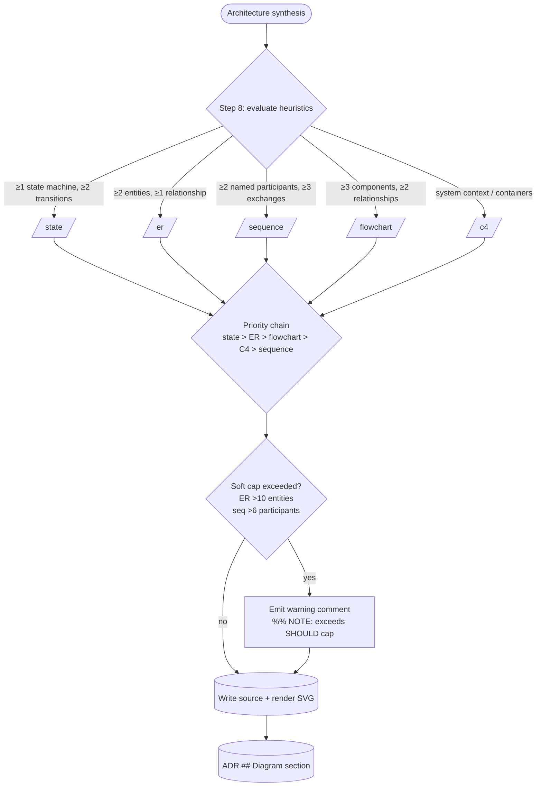

# ADR-003: ER and Sequence Diagram Types — v0.5 Activation

**Date:** 2026-04-28
**Status:** Accepted
**Decision makers:** user (liam.helmer); star-chamber providers (3 OpenAI providers — full review across question generation, design critique, and synthesis review)

## Context

ADR-002 (`2026-04-23-002-brains-diagramming.md`) shipped the `brains:diagram` skill in v0.4 with three active types — `flowchart`, `state`, and `c4` — and explicitly reserved two slots for v0.5: Mermaid `erDiagram` (`er`) and Mermaid `sequenceDiagram` (`sequence`). The reservations appear in ADR-002's Decision summary, Requirements §Skill structure (line 39: "In v0.5, the system SHOULD add `sequence.md` and `er.md`"), the priority chain `state > ER > flowchart > C4 > sequence` baked into both `skills/brains/SKILL.md` step 8 and `skills/diagram/SKILL.md`, and the Consequences section.

ADR-002 left two pieces of v0.5 detail unfinished:
1. The `er` heuristic threshold was named (≥2 entities + ≥1 relationship) but the `sequence` heuristic was described only by vocabulary signal ("request / call / message" in `docs/diagrams.md` line 205) without a concrete count-based threshold.
2. No statement on cap behavior for diagrams that exceed practical readability limits (Mermaid `erDiagram` rendering breaks down at >10 entities per upstream issues #4342 and #8153; `sequenceDiagram` becomes unreadable beyond ~6 participants).

This ADR resolves those gaps and promotes both types from reserved to active.

## Decision

Activate `er` and `sequence` as v0.5.0 active diagram types in `brains:diagram`. The change is additive to ADR-002: two new lazy-on-demand reference files, two new rows in each routing table, one new heuristic threshold for `sequence`, and removal of the three "v0.5-only / reserved" gate strings. No changes to the renderer pipeline, the visual-companion bundle, or the existing types.

The `sequence` heuristic is **count-based** (parity with `state`, `er`, `flowchart`): ≥2 named participants AND ≥3 ordered message exchanges between them. Linear event narratives without named senders/receivers ("then A happens, then B, then C") fall through to `flowchart` rather than over-triggering `sequence`.

Soft caps on auto-generated diagram size are **SHOULD-level** with a warning fallback: when the synthesizer determines that the architecture exceeds the cap (ER ≤10 entities; sequence ≤6 participants), the system emits the diagram with a one-line warning comment in the source file rather than silently truncating or refusing to generate.

ADR-002 is amended by appending a "Revision 3" note recording this promotion; the body of ADR-002 is not rewritten.

## Requirements (RFC 2119)

### Reference files

- The system MUST ship `skills/diagram/references/er.md` and `skills/diagram/references/sequence.md` as new lazy-on-demand reference files.
- Each per-type reference file MUST remain under 3 KB (per ADR-002's existing budget).
- Each file MUST follow the existing reference shape: intro paragraph; one canonical-syntax code block; a "Common Pitfalls" section with 5 numbered bullets; a "Skeleton" section with a minimal example.

### Routing and heuristics

- `skills/diagram/SKILL.md` MUST list `er` and `sequence` in the `--type` value enumeration and the routing table.
- `skills/diagram/SKILL.md` MUST remove the `Reserved future slots (v0.5, inactive): ER (after state), sequence (after C4)` line.
- `skills/diagram/SKILL.md` argument-hint MUST be updated to enumerate the full active type list.
- `skills/diagram/SKILL.md` option-5 regeneration enumeration MUST be extended to recognize `<adr-stem>-er.mmd` and `<adr-stem>-sequence.mmd`.
- `skills/diagram/references/renderer-conventions.md` MUST list `er` and `sequence` in the POST-path table (both `/mermaid/svg`) and in the `mmdc`-applicable-types note.
- `skills/diagram/references/storage-conventions.md` MUST list `er` and `sequence` in the source-extension table (both `.mmd`) and in the `## Diagram` field-substitutions table (alt text, source-label, fenced-block-language).
- `skills/brains/SKILL.md` step 1 MUST list `er` and `sequence` as valid `--diagram <type>` values.
- `skills/brains/SKILL.md` step 8 MUST remove the qualifier "ER and sequence are v0.5-only types — their heuristics evaluate but no diagram is dispatched until those reference files ship."
- `skills/brains/SKILL.md` step 8 MUST add the concrete `sequence` heuristic: "the decision describes ≥2 named participants AND ≥3 ordered message exchanges (request/response, call/return, publish/subscribe, or sequential event steps) between them. Linear event narratives without named senders and receivers fall through to `flowchart`."
- `skills/brains/SKILL.md` step 9 (option-5 regeneration) MUST add `er` and `sequence` to the per-ADR-stem enumeration and to the `.mmd`-extension check set.
- The auto-trigger priority chain `state > ER > flowchart > C4 > sequence` (already locked in ADR-002) is unchanged.

### Soft caps and fallback

- `er.md` MUST recommend ≤10 entities per diagram via a SHOULD-level guidance note.
- `sequence.md` MUST recommend ≤6 participants per diagram via a SHOULD-level guidance note.
- When the synthesizer determines that the architecture would exceed a SHOULD-level cap, the system MUST emit the diagram with a one-line warning comment as the second line of the source file: `%% NOTE: exceeds SHOULD cap of N entities; consider splitting` (or `participants` for sequence). The auto-trigger marker on line 1 is unchanged.
- The system MUST NOT silently truncate, refuse to generate, or substitute a different diagram type when a soft cap is exceeded.
- The warning comment is regex-assertable (`^%% NOTE: exceeds SHOULD cap`) for test verification.

### Documentation

- `docs/diagrams.md` MUST replace the "Reserved for v0.5" section (currently lines 202–207) with active `er` and `sequence` subsections matching the existing `flowchart`, `state`, and `c4` sections.
- `README.md` MUST update the `diagram` skill row to reflect the full active type list (`flowchart`, `state`, `c4`, `er`, `sequence`).
- `docs/adr/2026-04-23-002-brains-diagramming.md` MUST receive a "Revision 3 (2026-04-28)" note documenting the v0.5 promotion. The body of ADR-002 MUST NOT be rewritten.

### Companion (no change)

- The visual-companion `frame-template.html` MUST NOT require modification: the existing `mermaid@11` ESM CDN import bundles the `erDiagram` and `sequenceDiagram` parsers natively. This is a documented expectation, not a new requirement.

### Token budgets

- Each new per-type reference file MUST remain under 3 KB.
- `skills/diagram/SKILL.md` MUST remain under 4 KB (ADR-002's existing budget).
- Net growth in `skills/brains/SKILL.md` from this ADR's changes MUST NOT exceed 20 lines.

### Versions (SHOULD)

- The system SHOULD treat Mermaid 11.13.x as the validated baseline. The `mermaid@11` CDN tag in `frame-template.html` resolves to the latest 11.x release; documentation MUST note 11.13.x as the validated test baseline.
- Kroki MUST be the local containerized variant only (per ADR-002's no-default-cloud rule); no change.

## Rationale

**Count-based sequence heuristic.** The existing heuristic family for state, ER, and flowchart is uniformly count-based ("≥N components AND ≥M relationships"). A vocabulary-signal heuristic for sequence would break that pattern, drift over time as protocol vocabulary evolves, and overlap with flowchart triggers (a retry loop with named actors reads as both a control flow and a message exchange). The count-based threshold of ≥2 named participants AND ≥3 ordered exchanges is concrete, unambiguous in synthesis, and excludes trivial A-asks-B cases that a labelled flowchart edge already conveys. The "named participants" qualifier prevents over-triggering on linear event narratives.

**Two ADRs, not one.** This ADR ships alongside ADR-004 (`--grill` strategy modifier). The two features are unrelated — one expands the diagram-type surface; the other modifies phase-1 questionnaire behavior. Single-Responsibility for ADRs makes future search, cross-reference, and amendment cleaner. Both ADRs explicitly cite v0.5.0 as their joint release.

**SHOULD-level soft caps with warning fallback.** Hard MUST caps would silently truncate genuinely-large architectures and create awkward boundary behavior; no caps would emit visibly broken SVGs (per Mermaid issues #4342 and #8153) with no signal to the user that the source is fine. The SHOULD + warning approach matches ADR-002's RFC-2119 idiom, preserves user-authored architecture, makes the breach visible in source, and is regex-assertable in tests. Star-chamber called out fallback policy as an open detail in ADR-002; this ADR closes it.

**v0.5.0 minor bump.** ADR-002 explicitly published v0.5 as the milestone label for this work. Honoring that label is worth more than preserving v0.5.0 for hypothetical future scope. The minor bump signals to users that the diagram-type surface is now complete per the ADR-002 roadmap.

**Linear-narrative fall-through clarification.** Star-chamber flagged a risk that the sequence heuristic could over-trigger on linear event narratives ("event A, then event B, then event C") that are better represented as flowcharts. The "named senders/receivers" requirement in the heuristic resolves this; the ADR text spells it out explicitly to prevent the failure mode.

## Alternatives Considered

### Vocabulary-signal sequence heuristic (Candidate B from research)
- Pros: high precision when protocol language is present (HTTP pairs, webhooks, pub/sub).
- Cons: open-ended vocabulary list drifts; breaks the uniform count-based style; overlaps with flowchart retry-loop triggers; more pattern-matching complexity.
- Why rejected: pattern-parity with existing heuristics outweighs precision gains for vocabulary-rich cases. The count-based threshold catches the same cases when the architecture is sufficiently detailed to warrant a sequence diagram.

### Manual-only `sequence` (Candidate C from research)
- Pros: zero false positives; smallest implementation change.
- Cons: breaks parity with the four auto-triggering types; low discoverability for a published feature; underdelivers on ADR-002's auto-select framing.
- Why rejected: the user's explicit feature request was to activate auto-triggering; manual-only contradicts that intent.

### v0.4.5 point release
- Pros: matches scope-to-bump convention (small additive change).
- Cons: contradicts ADR-002's explicit v0.5 milestone label; weakens the ADR-002 roadmap as a citable record.
- Why rejected: honoring published milestones outweighs scope-to-bump convention for documentation hygiene.

### One combined ADR-003 covering both v0.5 features
- Pros: single read for v0.5; simpler git footprint.
- Cons: conflates unrelated concerns (diagram types vs questionnaire interaction policy); future "why was --grill added?" search hits an ADR titled around diagrams.
- Why rejected: Single-Responsibility for ADRs makes long-term maintenance cleaner.

### Hard MUST caps on diagram size
- Pros: deterministic output; renderer never produces broken cardinality circles or unreadable swimlanes.
- Cons: silently truncates genuinely-large architectures; MUST-level caps in a reference file are hard to override from CLI.
- Why rejected: silent truncation hides information; the SHOULD + warning approach preserves user intent without sacrificing renderer reliability.

### No caps; emit whatever the architecture implies
- Pros: simplest reference file; never hides info.
- Cons: known Mermaid bugs produce visibly broken SVGs with no source signal; >8-participant sequence diagrams are unreadable.
- Why rejected: known renderer bugs are not user-correctable; emitting a broken SVG is strictly worse than emitting a warned source.

## Assumed Versions (SHOULD)

- Mermaid: 11.13.x validated baseline; `@11` CDN tag for runtime resolution.
- Kroki: local container only (per ADR-002).
- mmdc (`@mermaid-js/mermaid-cli`): unchanged from ADR-002; covers `er` and `sequence` (both Mermaid types).

## Diagram

<!-- renderer unavailable; to enable SVG rendering, run /brains:setup --with-kroki (required for c4) or install @mermaid-js/mermaid-cli (Mermaid types only) -->

Mermaid source

## Consequences

`/brains:diagram` gains two new `--type` values: `er` and `sequence`. Phase-1 ADR generation now auto-triggers `er` for architectures with ≥2 entities + ≥1 relationship and `sequence` for architectures with ≥2 named participants + ≥3 ordered exchanges. The priority chain `state > ER > flowchart > C4 > sequence` (locked in ADR-002) is unchanged; `er` was already in the chain at position 2, and `sequence` was the lowest priority. Diagrams that exceed the SHOULD-level caps emit with a `%% NOTE: exceeds SHOULD cap` warning rather than failing or truncating. The visual-companion bundle requires no changes — the existing `mermaid@11` import covers both new types. ADR-002 receives a Revision 3 note documenting the promotion.

The diagram-type surface is now complete per the ADR-002 roadmap. Future per-type additions would require a new ADR.

## Council Input

Three OpenAI providers participated in question generation, design critique, and synthesis review (one provider authentication-failed on `nemotron-ultra-253b` across all rounds; one timed out on a single round). Accepted recommendations: count-based sequence heuristic (consensus), SHOULD-level soft caps with warning fallback (consensus), two-ADR structure over a combined ADR (consensus), explicit linear-narrative fall-through clarification (council flagged the over-trigger risk and the ADR now spells out the named-participants requirement), and pin Mermaid 11.13.x as a validated test baseline rather than an open-ended `≥11.13` constraint. The council's suggestion to "defer ADR-004 to a follow-up after prototyping" was declined: the user explicitly requested both features in one pass, and the bounding refinements applied to ADR-004 (hard turn cap, mandatory check-in, batched-question mode) mitigate the council's underlying concern about unbounded grilling. No accepted recommendation was rejected.
