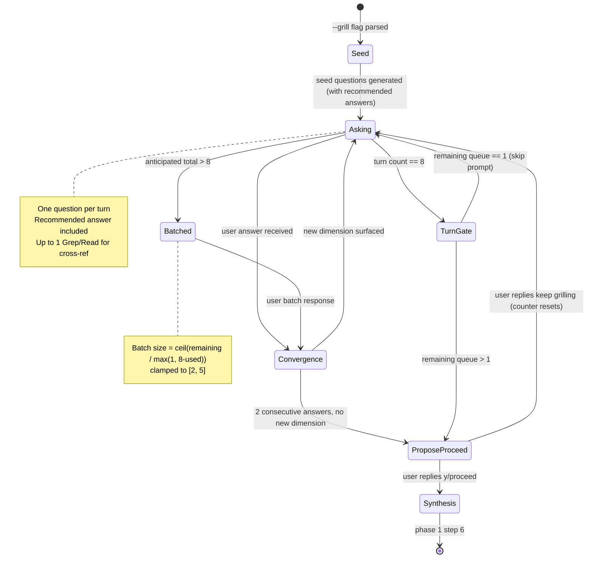

# ADR-004: `--grill` Strategy Modifier for `brains:brains` Phase 1

**Date:** 2026-04-28
**Status:** Accepted
**Decision makers:** user (liam.helmer); star-chamber providers (3 OpenAI providers — full review across question generation, design critique, and synthesis review)

## Context

`brains:brains` phase-1 (steps 3–5) generates "generally 2–4" architectural questions before architecture synthesis. The cap exists to keep ADR generation tractable and to respect user time, but it underdelivers on requests where the user wants thorough adversarial questioning before committing to an architecture — the kind of "interview me until we have a shared understanding" workflow described in Matt Pocock's [`grill-with-docs`](https://github.com/mattpocock/skills/tree/main/skills/engineering/grill-with-docs) skill.

The user requested an opt-in `--grill` mode that lifts the question cap and applies a more rigorous interview style: one question at a time, recommended answer per question, codebase-exploration-as-substitute-for-asking, fuzzy-language sharpening, edge-case scenario probing, and code cross-referencing for contradictions.

This ADR records `--grill` as a new flag on `/brains:brains` and defines its behavior, termination semantics, mode composition, and bounds.

## Decision

`--grill` is a **strategy modifier** — not an execution mode. It is orthogonal to the existing LLM-coordination flags (`--single`, `--parallel`, `--debate`, `--lean`) and modifies how phase-1 steps 3 (question generation) and 5 (questionnaire) behave. Selecting `--grill` does not change which providers are invoked; it changes the questionnaire policy.

`--grill` applies to phase 1 only. Downstream phases (`/brains:map`, `/brains:implement`) ignore the flag. `--grill` is **not** propagated to chained skills.

`--grill` composes with `--autopilot`: phase 1 runs to grill convergence, then autopilot semantics take over at the phase-1 gate (auto-select option 2, chain into `/brains:map --autopilot`). The handoff is intentional — phase 1 is high-touch by user election; downstream autopilot is the user's explicit opt-in to zero-touch from that point forward.

Termination is a **hybrid** of convergence detection and a hard turn cap, with a mandatory mid-session check-in:

1. **Convergence detector** runs after every user answer. If 2 consecutive answers raise no new architectural dimension, the system proposes: "I think we have shared understanding on this design. Ready to proceed to architecture synthesis? [y/N/keep grilling]"
2. **Turn budget of 8.** The system targets keeping total question turns ≤ 8. As long as anticipated total questions ≤ 8, the system asks one question per turn. If at any point anticipated total questions exceed 8, the system switches to batching with batch size in `[2, 5]`, sized to keep total turns within budget: `batch_size = ceil(remaining_questions / max(1, 8 - turns_used))`, clamped to `[2, 5]`.
3. **Mandatory check-in after turn 8.** Once 8 question turns have been consumed, the system MUST emit the proceed-prompt: "We've covered 8 question turns. Ready to proceed, or keep grilling? [y/N]" — UNLESS only 1 turn of questions remains, in which case the system asks that final turn directly (the round-trip cost of the proceed-prompt exceeds the cost of one more question turn).
4. The turn-8 check-in and the batching behavior MUST be communicated to the user upfront when `--grill` begins, so the policy is transparent rather than surprising.

"New architectural dimension" is defined operationally (not by LLM judgment alone): an answer raises a new dimension if it (a) names a new component not previously discussed, (b) introduces a constraint not previously surfaced, (c) names a new actor or persona, (d) introduces a new data type or entity, or (e) contradicts a prior answer requiring re-litigation.

## Requirements (RFC 2119)

### Flag and scope

- `/brains:brains` MUST accept a new `--grill` flag in step 1 argument parsing.
- `--grill` MUST be a strategy modifier, not a mode; it MUST compose with `--single`, `--parallel`, `--debate`, `--rounds N`, `--lean`, and `--autopilot`.
- `--grill` MUST apply only to phase-1 behavior. `/brains:map` and `/brains:implement` MUST ignore the flag if it appears in their argument lists.
- `--grill` MUST NOT be propagated to chained skills (unlike `--autopilot` and `--lean`).

### Composition with existing modes

- Under `--grill --single`: grilling MUST use only the local LLM for both seed-question generation and follow-ups.
- Under `--grill --parallel` (default): grilling MUST use star-chamber for the **seed** question generation only (per ADR-002's parallel-mode protocol); follow-up questions during grilling MUST be generated locally to keep latency manageable.
- Under `--grill --debate`: same as `--parallel` for the seed (debated across rounds); follow-ups MUST be local-only.
- Under `--grill --autopilot`: grilling MUST run to convergence in phase 1; after the phase-1 gate, autopilot semantics MUST take over (auto-select option 2 and chain into `/brains:map --autopilot`).
- Under `--grill --lean`: grilling MUST honor `--lean`'s compact-context protocol for the seed; follow-ups MUST omit star-chamber regardless of mode (already required above).

### Question generation (step 3)

- Under `--grill`, the system MUST generate an initial seed of 2–4 questions (same as today) AND a recommended answer for each.
- The seed set MUST be treated as the **first round** of grilling, not the full questionnaire. The "generally 2–4 questions" cap from non-grill mode is lifted.
- Each question generated under `--grill` (seed and follow-ups) MUST include a recommended answer with a one-sentence rationale.

### Questionnaire (step 5)

- After each user answer under `--grill`, the system MUST run the convergence detector against the operational definition of "new architectural dimension" (5 signals listed in Decision).
- Before generating a follow-up, the system SHOULD perform up to 1 Grep/Read codebase exploration to either (a) answer a candidate follow-up itself rather than asking, or (b) surface a contradiction with the user's stated answer. The 1-call budget per turn prevents latency spikes.
- If the codebase exploration fails (read error, file not found, etc.), the system MUST continue grilling without the cross-reference; it MUST NOT abort or re-raise the error.
- When the user's answer uses fuzzy or overloaded terms (e.g., "account", "customer", "session"), the system SHOULD propose a precise canonical term and ask for confirmation in the next question before incorporating into the architecture.
- When a domain relationship is being discussed, the system SHOULD probe with one concrete edge-case scenario before moving on.
- When the user states how something works and the codebase contradicts that statement, the system MUST surface the contradiction as the next grill question.

### Termination (hybrid)

- Convergence detector: if 2 consecutive answers (or batches) raise no signal from (a)–(e), the system MUST emit the proceed-prompt: "I think we have shared understanding on this design. Ready to proceed to architecture synthesis? [y/N/keep grilling]"
- Mandatory check-in after turn 8: once 8 question turns have been consumed, the system MUST emit the proceed-prompt: "We've covered 8 question turns. Ready to proceed, or keep grilling? [y/N]" — UNLESS only 1 turn of questions remains in the queue, in which case the system MUST ask that final turn directly without the proceed-prompt (the prompt's round-trip cost exceeds the cost of one more turn).
- The turn-8 check-in and the batching policy MUST be communicated to the user upfront, before the first grill question, with text along the lines of: "Grilling targets 8 total question turns. If more questions arise, I'll batch them. After 8 turns I'll check in with you to see if we should proceed or keep going."
- If the user responds `y`/`yes`/`proceed` to either prompt, grilling MUST exit and step 6 (architecture synthesis) MUST begin.
- If the user responds `keep grilling`, `n`, or `no`, the system MUST continue questioning. The "no new dimension" counter MUST reset to 0 on `keep grilling`. Continued questioning past turn 8 MUST use batched mode if remaining queue length > 1.

### Batched questioning

- The system MUST estimate anticipated total questions (seed + follow-ups) after each user response. When `turns_used + anticipated_remaining > 8`, the system MUST switch from one-at-a-time to batches.
- Batch size MUST be computed as `ceil(anticipated_remaining / max(1, 8 - turns_used))` clamped to the range `[2, 5]`.
- Each batched question MUST still include a recommended answer.
- The convergence detector MUST run after each user batch response, treating the batch as a unit: a batch where no question raised a new-dimension signal counts as 1 toward the 2-consecutive threshold.
- The system MUST NOT batch the seed-question generation under `--grill --parallel` or `--grill --debate` — those modes' star-chamber consultation on the seed assumes a non-batched seed set; batching applies only to follow-ups.

### Files

- The system MUST ship a new lazy-on-demand reference file `skills/brains/references/grill-protocol.md` (under 4 KB) containing: the operational definition of "new architectural dimension"; the codebase-exploration substitution rules; the fuzzy-term-sharpening rules; the edge-case-probing rules; the convergence-detector pseudocode.
- `skills/brains/SKILL.md` MUST be extended in step 1 (argument parsing for `--grill`), step 3 (question-generation behavior under `--grill`), step 5 (questionnaire behavior under `--grill`), and step 9 (the `--grill --autopilot` handoff note).
- `skills/brains/SKILL.md` net growth from this ADR's changes MUST NOT exceed 25 lines.
- `README.md` MUST document the `--grill` flag in the `brains:brains` section.

### Token budgets

- `grill-protocol.md` is lazy-on-demand and MUST contribute zero tokens to non-grill runs.
- `skills/brains/SKILL.md` net growth across both ADR-003 and ADR-004 MUST NOT exceed 45 lines.

## Rationale

**Strategy modifier, not mode.** `--single`, `--parallel`, and `--debate` select which LLMs participate in question generation and architecture review. `--grill` selects the *interview policy* — how aggressively to question, how to terminate, whether to lift the 2–4 cap. Treating it as a mode would imply that it replaces the LLM-coordination flags, which would force users to trade off council review for grilling. Strategy-modifier framing keeps both axes available.

**Phase-1 only, non-propagating.** The grill-with-docs source skill is fundamentally a discovery tool: it stress-tests a plan before commitment. That maps cleanly to phase 1 (architecture synthesis) and not to phases 2 or 3 (planning and implementation), where the user wants execution, not interrogation. Restricting scope keeps the v0.5.0 surface bounded and prevents accidental downstream UX degradation.

**Allow `--grill` + `--autopilot`.** Council split on this composition: one faction wanted mutex (interactive grilling and zero-touch autopilot are spiritually opposed); another endorsed the combo (grilling thoroughly *then* going heads-down is genuinely useful). The user chose composability. The handoff is documented so the user can opt out by simply not pairing the flags.

**Turn budget of 8 with mandatory check-in.** Council strongly flagged unbounded grilling as a token-blowout risk, especially with non-deterministic convergence detection. The 8-turn budget is small enough that no realistic session is invisibly drowning, and the user can override with "keep grilling" to continue. The 8 figure was chosen by the user as a compromise between "enough to develop shared understanding" (typically 4–6 questions in good interviews) and "not so many that the user loses track." The "1 turn left" exception to the check-in is a token-economy choice: the round-trip cost of asking "proceed?" then receiving "yes" then asking the question exceeds the cost of just asking the question, so the system skips the prompt when only one turn remains.

**Batching to fit within the turn budget.** Rather than letting question count grow unboundedly, the system actively reshapes its question delivery to fit within 8 turns whenever it can. As soon as the anticipated total exceeds 8, the system computes the batch size needed to bring total turns back to 8 (clamped to `[2, 5]` so batches stay reviewable). This is a deliberate departure from the source skill's "one question at a time" rule — the source skill optimizes for intimate UX; BRAINS optimizes for intimate UX *within a token budget*. Batches of 2–5 preserve the recommended-answer-per-question pattern while keeping turn count bounded. The exclusion of star-chamber-reviewed seed questions from batching preserves the council-review path under `--parallel`/`--debate`.

**Operational definition of "new architectural dimension."** Council flagged that "new architectural dimension" and "shared understanding" are subjective phrases unsuitable for deterministic behavior. The 5-signal operational definition (component, constraint, actor, data type, contradiction) gives the convergence detector something concrete to match against. False negatives (missed dimensions) are mitigated by the 8-turn check-in; false positives (premature termination) are mitigated by the user's "keep grilling" branch.

**1-Grep-per-turn budget.** Council flagged that "MUST cross-reference with code" could spawn unbounded codebase reads per answer. Capping at 1 read per turn keeps latency predictable and is enough to surface obvious contradictions without exhaustive search.

**Recommended answer per question.** Per the source skill: grilling without recommended answers degenerates into open-ended interrogation. Each question MUST include the system's recommended answer so the user can disagree concretely rather than starting from scratch each turn.

## Alternatives Considered

### `--grill` as a fourth execution mode (replacing `--single`/`--parallel`/`--debate`)
- Pros: simpler flag matrix; one mode at a time.
- Cons: forces a trade-off between council review and grilling; users wanting both would have to choose.
- Why rejected: the two axes are genuinely orthogonal (LLM coordination vs. interview policy); collapsing them loses real flexibility.

### `--grill` propagates to all phases
- Pros: uniform behavior; catches ambiguities later in the pipeline.
- Cons: large surface increase for v0.5.0; relentless questioning during map/implement is obstructive; phase-specific stopping criteria are hard to define.
- Why rejected: phase 1 is the natural home for grilling; downstream phases need execution, not interrogation.

### Mutex with `--autopilot`
- Pros: avoids the spiritual contradiction (interactive vs zero-touch); simpler to document and test.
- Cons: blocks the genuinely-useful "grill thoroughly, then go heads-down" workflow; forces a manual transition between phase 1 and downstream phases.
- Why rejected: the user explicitly preferred composition; the handoff at the phase-1 gate is documented and transparent.

### Convergence detector only (no hard turn cap)
- Pros: fully organic stop; matches the source skill's "until shared understanding" phrasing.
- Cons: convergence is subjective and brittle; risk of stopping too early or grilling too long; token-blowout exposure.
- Why rejected: hard cap at 8 with a "keep grilling" override gives the same organic feel without the tail risk.

### Hard cap only (no convergence detector)
- Pros: deterministic; simple to test.
- Cons: ignores the source skill's organic-termination intent; forces every user through 8 questions even when 4 would suffice.
- Why rejected: the convergence detector typically fires before the hard cap, so users with simple architectures aren't over-grilled.

### One question at a time forever (no batching)
- Pros: matches source skill verbatim; intimate UX.
- Cons: at 15+ questions, round-trip overhead dominates; user fatigue rises faster than insight.
- Why rejected: batching when anticipated questions exceed the 8-turn budget is a pragmatic concession to deep-grilling sessions while preserving the intimate UX in the early turns where it matters most.

## Assumed Versions (SHOULD)

- `brains:brains` SKILL.md: ADR-002 baseline.
- `brains:brains` references: ADR-001 (token-efficiency v0.3) baseline preserved; `--grill` honors the lazy-on-demand pattern.
- `star-chamber`: unchanged; ADR-002 baseline.

## Diagram

<!-- renderer unavailable; to enable SVG rendering, run /brains:setup --with-kroki (required for c4) or install @mermaid-js/mermaid-cli (Mermaid types only) -->

Mermaid source

## Consequences

`/brains:brains` gains a new `--grill` flag. Users invoking `/brains:brains --grill <topic>` enter a relentless-interview phase-1 with a recommended answer per question, codebase-exploration substitution, fuzzy-term sharpening, edge-case probing, and code-contradiction surfacing. Termination is hybrid: convergence detector + 8-turn budget with mandatory check-in (skipped when only 1 turn remains) + automatic batching to keep total turns within budget. The flag composes with all existing mode flags (`--single`, `--parallel`, `--debate`, `--lean`, `--autopilot`); `--grill --autopilot` runs phase 1 to convergence then chains into `/brains:map --autopilot`. The flag does not propagate to downstream phases.

A new lazy-on-demand reference file `skills/brains/references/grill-protocol.md` ships under 4 KB. `skills/brains/SKILL.md` grows by ≤25 lines. The token-efficiency budget from ADR-001 is preserved (zero contribution from `grill-protocol.md` on non-grill runs).

Future work may extend grilling to phases 2 and 3 if user feedback indicates value; this ADR explicitly scopes to phase 1.

## Council Input

Three OpenAI providers participated in question generation, design critique, and synthesis review (one provider authentication-failed on `nemotron-ultra-253b` across all rounds; one timed out once). Accepted recommendations: hybrid termination via convergence + user confirmation (consensus, "best balance of automation and user agency"); operational definition of "new architectural dimension" via 5 concrete signals (council flagged the subjectivity of the phrase); 1-Grep-per-turn budget for codebase exploration (council flagged latency-spike risk); reframe `--grill` as a strategy modifier rather than an execution mode (council framing accepted). User-driven refinements applied on top of the council's recommendations: 8-turn budget (council recommended a cap without specifying a value; user chose 8); upfront communication of the budget and batching policy to the user (user requested transparency); automatic batching with batch size in `[2, 5]` sized to fit within the 8-turn budget when anticipated questions exceed it (user-introduced refinement); the "1 turn left" exception to the proceed-prompt to avoid wasted round-trips (user-introduced refinement). The council's strongest dissent — that `--grill` and `--autopilot` should be mutex rather than composable — was overruled by user preference; the ADR documents the handoff to mitigate the council's underlying UX concern. The council's suggestion to "defer ADR-004 to a follow-up after prototyping" was declined: the user explicitly requested the feature in this pass, and the bounding refinements (hard cap, mandatory check-in, batched mode, operational dimension definition) mitigate the council's underlying concern about unbounded grilling.
