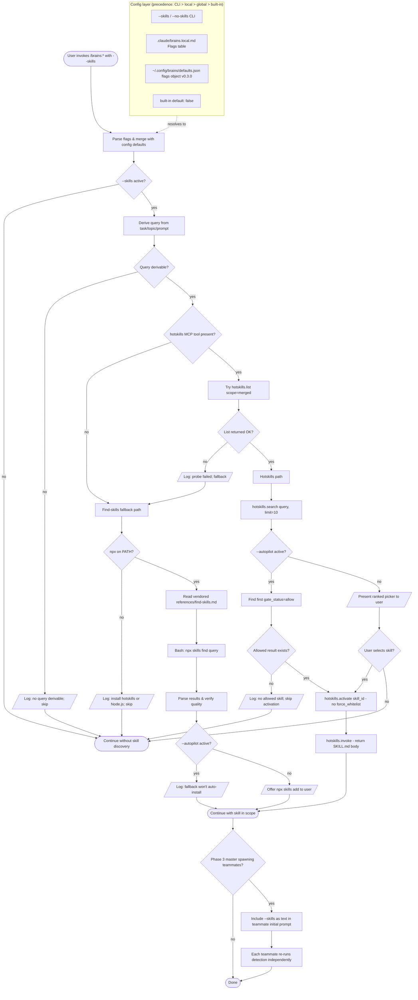

# ADR-005: BRAINS `--skills` Integration with hotskills and find-skills Fallback

**Date:** 2026-04-28
**Status:** Accepted
**Decision makers:** Liam Helmer + star-chamber (multi-LLM review)

## Context

BRAINS users frequently encounter tasks where an existing Claude Code skill (from skills.sh, vercel-labs, anthropics, etc.) would solve part of the work better than ad-hoc reasoning. Today, BRAINS has no integration with skill discovery — users must invoke `/hotskills` separately, and teammate Claude Code instances spawned by `/brains:implement` cannot search for or activate skills relevant to their phase.

Two skill-discovery systems are in scope:

- **epiphytic/hotskills** (preferred) — MCP-based, with security gating (audit, heuristic, install threshold), 1h search caching, and `hotskills.search` / `hotskills.activate` / `hotskills.invoke` tool calls. Currently at v0.1.4 (released 2026-04-28).
- **vercel-labs/skills** `find-skills` (fallback) — a markdown SKILL.md instruction document that teaches the model to call `npx skills find <query>` and `npx skills add <pkg>`. Currently at v1.5.1 (April 17, 2025).

Additionally, two related user requests are bundled into this ADR:

- **Config-default for `--grill`** — `--grill` was added in ADR-004 but has no config-default mechanism. Users who want it on by default must pass it every time.
- **Nurture should update docs/changelogs/READMEs/tests as it goes** — currently nurture writes tests but only updates docs in pause/timeout edge cases. The user wants this to be standard behavior, both in the nurture skill itself AND proactively in teammates as they implement.

## Decision

Add a new `--skills` orthogonal modifier flag to `/brains:brains`, `/brains:map`, and `/brains:implement` (propagated to teammates). Add config-default support for both `--skills` and `--grill` via a new `flags` object in `~/.config/brains/defaults.json` (schema v0.3.0) and a parallel optional override in `.claude/brains.local.md`. Vendor a copy of `find-skills/SKILL.md` at `references/find-skills.md` as the fallback when hotskills is unavailable. Strengthen nurture's doc-update behavior in two places — the nurture skill's review checklist AND the teammate `T4` proactive-doc-update bullet.

The `--skills --autopilot` safety contract: rely on hotskills' `gate_status=allow` as the security gate; never bypass to whitelist. When `gate_status != allow`, skip activation with a logged warning. Autopilot does not weaken hotskills' gating.

## Requirements (RFC 2119)

### `--skills` flag and detection

1. The `/brains:brains`, `/brains:map`, and `/brains:implement` skills MUST accept `--skills` as an orthogonal modifier flag composing with all mode flags (`--single`/`--parallel`/`--debate`), `--autopilot`, `--lean`, and (phase-1 only) `--grill`.
2. When `--skills` is set, the skill MUST attempt hotskills detection in the following order:
   - **(a)** Check whether the tool name `mcp__plugin_hotskills_hotskills__hotskills_search` is present in the current session's available tools.
   - **(b)** If present, call `hotskills.list({scope:"merged"})` inside a try/catch.
   - **(c)** If both succeed, treat hotskills as available; otherwise fall through to the find-skills fallback.
3. The skill MUST log a single-line user-visible warning when the detection probe fails or when fallback fires (e.g., `"hotskills detected but list() failed; using find-skills fallback this session"`). The warning MUST NOT abort the run.
4. Each session (master AND each teammate) MUST probe independently. Master MUST NOT pass a resolved provider value to teammates — only the raw `--skills` flag text in the initial prompt.
5. The skill SHOULD pin a minimum hotskills version of `0.1.4` and MUST document the exact tool names and field names relied on (`hotskills.search`, `hotskills.activate`, `gate_status`, `skill_id`) in `references/find-skills.md`'s maintenance header. Detection breakage on hotskills API rename is acceptable failure (silent fall-through to fallback).

### Hotskills invocation behavior

6. When hotskills is available AND `--skills` is set AND a query is derivable (see requirement 17), the skill MUST call `hotskills.search({query, limit:10})`.
7. When `--autopilot` is also set, the skill MUST automatically activate the first result with `gate_status === "allow"` by calling `hotskills.activate({skill_id, install_count})`. The skill MUST NOT pass `force_whitelist: true` regardless of any flag combination.
8. When `--autopilot` is NOT set, the skill MUST present the ranked picker (per `/hotskills` Case C) and await user selection before activating.
9. When no result has `gate_status === "allow"`, the skill MUST surface the top result's gate reason and SHOULD prompt the user (under `--autopilot`: log and skip; do NOT block the autopilot run).

### Find-skills fallback

10. When hotskills detection fails, the skill MUST consult the vendored instruction document at `references/find-skills.md` (relative to the BRAINS plugin root).
11. The vendored document MUST be a copy of `https://raw.githubusercontent.com/vercel-labs/skills/main/skills/find-skills/SKILL.md` with a prepended maintenance header documenting (i) the source URL, (ii) the SHA at vendor time, (iii) a reminder to refresh on each BRAINS minor release, (iv) the hotskills MCP API version this fallback is paired with.
12. The skill MUST verify `npx` is on PATH before invoking the fallback (`command -v npx`). If `npx` is absent, the skill MUST log a clear error (`"Skills discovery requires either hotskills (preferred) or Node.js/npx for the find-skills fallback. Install one to use --skills."`) and continue without skill discovery for the session.
13. The skill MUST follow the vendored instructions to invoke `npx skills find <query>` via the Bash tool and parse results.
14. Under `--autopilot`, the fallback MUST NOT auto-install any skill (`npx skills add ...`). Auto-install is reserved for the hotskills path where `gate_status` provides a security gate.

### Configuration

15. The `~/.config/brains/defaults.json` schema MUST be bumped to v0.3.0 with a new top-level `flags` object: `{ "version": "0.3.0", "defaults": {...}, "debate_rounds": N, "flags": { "skills": <bool>, "grill": <bool> } }`.
16. `/brains:setup --global` MUST migrate stale v0.1.0 / v0.2.0 files by **merging** rather than overwriting — preserving any user-set values for existing keys, adding only missing keys, and bumping the `version` field. The setup skill MUST NOT delete user customizations.
17. `.claude/brains.local.md` MAY contain a "Flags" markdown table mirroring the same boolean keys for per-project overrides. The setup skill's `--local` mode MUST write this table when invoked.
18. Precedence MUST remain: explicit CLI flag > `.claude/brains.local.md` Flags table > `~/.config/brains/defaults.json` `flags` object > built-in default (`false`).
19. When `flags.skills: true` is configured, the skill MUST behave as if `--skills` was passed; CLI `--no-skills` MUST override to disable. (Same for `flags.grill: true` and `--no-grill`.)

### Query derivation

20. When `--skills` is set, the skill MUST derive the search query from context in this order: (a) explicit `--skills-query "..."` argument if added in a future iteration (out of scope here), (b) the current beads task title (phase 2/3), (c) the topic slug (phase 1), (d) the user's original prompt (truncated to 80 chars). If no query is derivable, the skill MUST log `"no query derivable for --skills; skipping skill discovery"` and skip.

### Teammate propagation

21. The master `/brains:implement` skill MUST include `--skills` as text in the teammate initial prompt when set, mirroring the `--lean` propagation pattern. The skill MUST NOT pass a resolved provider value.
22. The teammate's `teammate.md` T1 step MUST parse `--skills` from the initial prompt and run requirements 2–14 independently in the teammate session.
23. `--grill` MUST NOT propagate to teammates (already documented in `brains/SKILL.md:45`). This ADR does not change that.

### Nurture doc-update behavior

24. The `nurture` skill's Step 2 completeness checklist MUST add a bullet: "Are user-facing docs (README, CHANGELOG, ADRs) updated to reflect the changes in this scope?"
25. The `nurture` skill's issue-priority table MUST add a `P1 | Missing docs` row with the same priority tier as missing tests.
26. The `nurture` skill's Step 5 fix block MUST extend the P1 description from "Missing features/tests" to "Missing features/tests/docs" and include README/CHANGELOG updates in the fix scope.
27. The `teammate.md` T4 block MUST add a bullet: "When implementing tasks that change user-facing behavior or add new options, update README and CHANGELOG entries in the SAME commit as the code change. Docs land with the code, not as trailing cleanup."
28. CHANGELOG entries SHOULD follow the existing project convention. If no `CHANGELOG.md` exists at the repo root, the teammate MUST file a `bd create` follow-up task rather than creating one unilaterally.

### Lean composition

29. Under `--skills --lean`, the vendored `references/find-skills.md` MUST be lazy-loaded only when fallback is triggered (no upfront cost when hotskills is available or `--skills` is unset).

### Maintenance

30. The vendored `references/find-skills.md` SHOULD be refreshed at each BRAINS minor release. The `nurture` skill of the BRAINS plugin's own development MAY file a `bd create` task labelled `brains:nurture:vendored-docs-refresh` whenever a release-prep nurture run notices the vendored copy is older than 90 days.

### Research document path migration

31. Research documents produced by `/brains:brains` step 2 MUST be written to `docs/research/YYYY-MM-DD-<slug>-research.md` (NEW canonical path) — not `docs/plans/`. The `docs/plans/` directory is reserved for in-flight planning artifacts (map, phase reports, wrap-up, paused state); `docs/research/` is the immutable archive of phase-1 exploration.
32. The phase-1 SKILL.md, phase-2 SKILL.md, the research-summary stash path under `--lean`, and any research-staleness check in phase 2 MUST be updated to use `docs/research/` for new files. Existing research documents in `docs/plans/` are NOT migrated automatically; the migration of pre-existing files is performed once during phase 1 of this ADR's implementation (in-scope, listed as a task) and SHOULD be a no-op for new ADR runs.

### Autopilot ADR gate (HITL preserved by default)

33. `/brains:brains --autopilot` MUST still present the ADR gate (step 9) and wait for user input by default. Autopilot bypasses the plan gate (`/brains:map` step 7) and per-phase implementation gates, but NOT the ADR review gate. ADRs encode architectural commitments too consequential to auto-accept blindly.
34. A new flag `--accept-adrs` MUST be accepted by `/brains:brains` (and propagate to chained `/brains:map` and `/brains:implement` if relevant). When `--autopilot --accept-adrs` are both set, the skill MUST auto-select option 2 at the ADR gate (the prior `--autopilot` semantics). When `--autopilot` is set without `--accept-adrs`, the skill MUST present the gate normally and await user input.
35. The `--accept-adrs` state MUST be persisted in the plan header as `Accept-ADRs: true | false` so `/brains:implement --resume` honors the setting consistently with `--autopilot`.

### ADR push to topic branch (PR-style review)

36. When phase 1 commits an ADR (step 9, options 1-3), the commit MUST land on a topic branch (`brains/<slug>` or any non-base branch) — not on a base branch (`main`/`master`/`develop`). If the user is on a base branch when phase 1 reaches step 9, the skill MUST offer (or, in `--autopilot`, auto-create) the topic branch BEFORE the ADR commit. This is the same branch-offer logic that currently lives in `/brains:map` step 3, hoisted into phase 1.
37. After the ADR is committed and pushed, the skill SHOULD print the GitHub PR-creation URL (or `gh pr create --draft` invocation) so the user can open a draft PR for the ADR review. This is OPTIONAL but RECOMMENDED — it is what makes the ADR reviewable as a diff. Skip this when no GitHub remote is detected.
38. `/brains:map` step 3 MUST be updated to be a no-op when phase 1 already moved the user to a topic branch (the common case under the new flow). It still applies in the standalone `/brains:map` invocation path where phase 1 was skipped.

### CI status check during grooming

39. Each phase's grooming subagent (T2 in `teammate.md`) MUST, at the END of grooming, perform a quick CI status check IF (a) the repo has a GitHub remote (`git remote get-url origin` matches `github.com`) AND (b) the `gh` CLI is installed (`command -v gh`). The check uses `gh run list --limit 10 --branch <current-branch> --json status,conclusion,name,databaseId,createdAt` (or equivalent).
40. The grooming subagent MUST NOT wait for in-flight runs to finish. The check is read-only and reports current state only.
41. For each failed run (`conclusion in [failure, timed_out, action_required, cancelled]`), the grooming subagent MUST check whether that workflow was already failing on the immediate parent commit (`git rev-parse HEAD~1`). If yes, do nothing (pre-existing failure, not introduced by this work). If no (new failure introduced by this phase or its baseline), file a beads task: `bd create --title "Investigate CI failure: <workflow name>" --type=bug --priority=2`, label it with `brains:topic:<slug>` AND `brains:phase-<N+1>` (next phase) OR `brains:cleanup` if this is the final phase, AND `ci-failure`.
42. If `gh` is missing OR the repo has no GitHub remote, the grooming subagent MUST log a one-line note (`"CI check skipped: <gh missing | no GitHub remote>"`) and continue. CI checks MUST NOT block grooming completion.
43. The CI check MUST run after grooming (after `brains:ready-for-grooming` → `brains:groomed` label swap completes), so the investigation tickets it files do NOT enter the current phase's groomed task list.

## Rationale

**Why probe instead of config-marker for hotskills detection.** A config file is "was it installed at any point" — not "is it usable now." A probe is the only signal that catches plugin-disabled, MCP-server-down, and version-mismatch failures in one call. Combining the tool-name presence check with the `hotskills.list` probe is cheap (zero extra cost when the tool is absent — no spurious tool call), and yields a definitive "yes/no" without subprocess overhead.

**Why vendor find-skills instead of WebFetch.** Reproducibility (every BRAINS user with the same plugin version sees the same fallback instructions), offline support, and precedent (hotskills itself vendors vercel-skills at `vendor/vercel-skills/`). The maintenance burden of refreshing a small instruction doc is minor compared to network-fetched-on-every-invocation.

**Why a `flags` object instead of separate JSON keys.** A single nested object scales — when the next boolean flag arrives, it slots in without another schema bump. The migration path is trivial: missing keys default to `false`. Both per-user (`defaults.json`) and per-project (`brains.local.md`) tiers stay aligned with the existing 4-layer precedence.

**Why both nurture-side AND teammate-side doc updates.** "Update docs as it goes" can mean two things — proactively during implementation (teammate side) or reactively during review (nurture side). The user's wording emphasized "as it goes," which strongly suggests during implementation. But teammate-only is fragile (if a teammate forgets, no safety net), so nurture's review checklist provides the gate. Belt-and-suspenders.

**Why no force-whitelist under `--autopilot`.** Star-chamber correctly flagged this as a safety contract conflict. `--autopilot` skips user gates for *flow*, not for *security*. hotskills' `gate_status` IS the security gate — bypassing it because the user passed `--autopilot` would let any audit-failing skill auto-install during an unattended run. The safer default: gate-blocked skills are silently skipped under `--autopilot`, with a log line so post-hoc inspection can surface them.

**Why merge-not-overwrite for config migration.** Some users have custom values in their global config (the live system on this machine has `teammateModel: "opus"` in `settings.local.json` — exactly the kind of thing a destructive overwrite would clobber). Merging is the only safe migration semantics.

## Alternatives Considered

### Alternative 1: hotskills-only, no fallback
- Pros: Simpler implementation; one code path
- Cons: Hard dependency on a first-day-of-release plugin; offline failures; users without hotskills can't use `--skills` at all
- Why rejected: Excludes too many users; vercel-labs/skills predates hotskills and is a viable independent option

### Alternative 2: WebFetch find-skills at runtime instead of vendoring
- Pros: No maintenance burden; always current
- Cons: Network required on every invocation; reproducibility lost; CI/air-gap broken
- Why rejected: hotskills itself sets the precedent of vendoring upstream skill files; the maintenance cost is small for a stable doc

### Alternative 3: Config defaults under `.claude/settings.local.json`'s `brains` key
- Pros: Already designated for boolean runtime knobs (`escalateOnRetry`)
- Cons: Two files to read; not surfaced by `/brains:setup`; no global tier
- Why rejected: Splits the config story; `defaults.json` is the documented home for global defaults

### Alternative 4: Pass resolved provider value (`skills_provider: hotskills`) to teammates
- Pros: Master and teammates always agree
- Cons: Teammate sessions have independent MCP state; locking to master's resolution can be wrong; overcomplicated
- Why rejected: `--lean` precedent shows raw flag propagation works; re-probing per session is cheap and accurate

### Alternative 5: Nurture-only doc updates (no teammate-side bullet)
- Pros: Single point of responsibility; simpler
- Cons: Docs land in a separate commit from the code change, breaking the "as it goes" intent; nurture may run hours/days after the code change
- Why rejected: User explicitly asked for "as it goes" behavior

## Assumed Versions (SHOULD)

- hotskills: ≥ 0.1.4 (npm); ≥ 0.1.0 (`.claude-plugin/plugin.json` lags npm)
- hotskills MCP API surface: tools `hotskills.search`, `hotskills.activate`, `hotskills.invoke`, `hotskills.list`, `hotskills.deactivate`, `hotskills.audit` per ADR-001
- vercel-labs/skills: 1.5.x — find-skills location `skills/find-skills/SKILL.md` on `main` branch
- Node.js: ≥ 18 (required for `npx skills find`); ≥ 22 if hotskills is also needed
- BRAINS: ≥ 0.5.0 (target release for this ADR)

## Diagram

<!-- renderer unavailable; to enable SVG rendering, run /brains:setup --with-kroki (required for c4) or install @mermaid-js/mermaid-cli (Mermaid types only) -->

Mermaid source

## Consequences

**New surface introduced:**
- `--skills` and `--no-skills` flags in three skills (brains, map, implement) and teammate.md
- New file: `references/find-skills.md` (vendored from vercel-labs/skills)
- Schema bump: `~/.config/brains/defaults.json` v0.2.0 → v0.3.0 with new `flags` object
- New `Flags` table in `.claude/brains.local.md` (optional)
- New nurture P1 priority `Missing docs`
- New `teammate.md` T4 bullet on proactive doc updates
- New maintenance note in `AGENTS.md` (BRAINS plugin root) documenting the vendored find-skills refresh policy

**Test plan:**
- E2E test: tool-name absent → fallback path fires, `npx skills find` is invoked
- E2E test: tool-name present, `hotskills.list` throws → fallback fires, warning logged
- E2E test: `--skills --autopilot` with `gate_status="allow"` → skill activates, `force_whitelist` not passed
- E2E test: `--skills --autopilot` with no allow-status results → log emitted, autopilot continues, no activation
- E2E test: `--skills` without `npx` available → clear error, run continues
- Migration test: write v0.1.0 `defaults.json` with custom value, run `/brains:setup --global`, assert v0.3.0 with prior value preserved + `flags` block added with defaults
- Cross-session test: master gets hotskills, teammate gets fallback (mocked) → both produce a result, divergence is logged
- Composition test: every flag combination involving `--skills` (with `--single`/`--parallel`/`--debate`/`--autopilot`/`--lean`/`--grill`) parses and propagates correctly

**Backward compatibility:**
- `defaults.json` v0.2.0 users get a non-destructive merge; missing `flags` keys default to `false`
- Existing `--lean` / `--autopilot` / `--grill` behavior unchanged
- Existing nurture behavior augmented (additive bullets), never reduced

**Risks accepted:**
- hotskills 0.1.x API surface is unstable; rename of any tool name silently triggers fallback (acceptable degradation; surfaces as warning log)
- Vendored `find-skills.md` will drift from upstream over time; maintenance is human-driven via the `AGENTS.md` note + nurture-filed beads tickets

## Council Input

Star-chamber surfaced 9 concerns. All are addressed in Requirements:

1. 🔴 **hotskills 0.1.4 API instability** → req. 5 (pin minimum, document API surface)
2. **`--skills --autopilot` silent install vs. autopilot safety contract** → req. 7, 14 (no `force_whitelist`; gate-blocked skips with log)
3. **`npx` unavailability** → req. 12 (explicit error, continue)
4. **Partial hotskills registration** → req. 3 (warning log on probe failure)
5. **`--skills` with no query** → req. 20 (query-derivation order; skip if undeterminable)
6. **`--skills --lean` interaction** → req. 29 (lazy-load vendored doc)
7. **Vendored doc drift** → req. 11, 30 (maintenance header; nurture-filed refresh tickets)
8. **v0.1.0 config re-bootstrap clobbering customizations** → req. 16 (merge, not overwrite)
9. **Test plan gaps** → addressed in Consequences "Test plan" section
