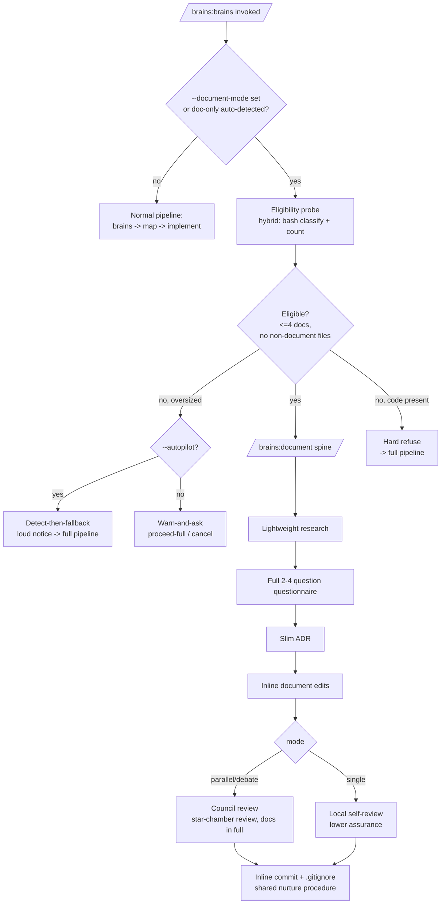

# ADR-006: BRAINS Document Mode

**Date:** 2026-05-23
**Status:** Accepted (revised 2026-05-23, pre-merge — see Revision note)
**Decision makers:** liam.helmer (user) + star-chamber council (gemini-3.1-pro, gpt-5.4 via FueliX)

## Context

The full BRAINS pipeline (`/brains:brains` → `/brains:map` → `/brains:implement` → nurture → secure) is calibrated for code-bearing architectural work: it produces a full ADR, a stub-level plan with beads tasks, spawns one teammate Claude Code instance per plan-phase, and closes with code-focused nurture and secure passes. For changes that **only edit documents** (markdown and prose, not code), this machinery is disproportionate — it pays planning, orchestration, and security-review cost for work that has no code to plan, orchestrate, or scan.

There is currently no document-aware fast path. The only existing acknowledgement of documentation work is a human-readable "When NOT to Suggest → Documentation updates" heuristic in `/brains:suggest`; there is **zero** programmatic document-type detection, file classification, or dependency counting anywhere in the codebase (see `docs/research/2026-05-23-brains-document-mode-research.md` §7).

We want an abbreviated protocol for document-only work that: skips planning/orchestration and goes straight to editing; preserves a (slim) decision record and the interactive questionnaire; and — instead of nurture + secure — reviews the **final document(s) directly with the star-chamber council**. It must refuse to apply to non-trivial scopes (> 4 documents), be auto-invoked when a change is document-only, and be manually triggerable via `--document-mode`.

## Decision

Introduce **document mode** as a new standalone, user-invocable skill `/brains:document`, with early delegation hosted in `/brains:brains` Step 1.

- `/brains:document` is the **canonical** entry and owns the entire abbreviated spine. `/brains:brains` gains a `--document-mode` flag and a pre-flight guard at the top of Step 1 that runs the eligibility probe and **delegates** to `/brains:document` when the work is document-only and eligible (or when `--document-mode` is set), forwarding the mode flag, `--autopilot`, and `--lean`. Auto-invocation is therefore hosted at the one place that can route before any phase begins; `/brains:suggest` carries a pointer.
- The abbreviated spine is: **eligibility gate → (lightweight research) → full 2–4 question questionnaire → slim ADR → inline document edits → direct council review → inline commit.** It skips `/brains:map`, teammate orchestration, `/brains:nurture`, and `/brains:secure`.
- Detection is **hybrid**: deterministic bash classifies and counts the changed working-tree file set; the main LLM resolves in-scope documents from the prompt for greenfield work. This avoids the council-flagged failure of trying to do natural-language scope resolution in bash alone, while keeping the numeric gate fully deterministic.
- Eligibility ceiling: ≤ 4 **target** documents, with zero non-document files in the changed set. Threshold/ineligibility handling is mode-sensitive: **warn-and-ask** interactively, **detect-then-fallback** under `--autopilot`. Manual `--document-mode` on an ineligible change is **asymmetric**: warn-and-confirm for oversized-but-document-only scopes; hard-refuse when actual code **files** are present (fenced/example code *inside* a document never triggers refusal).
- Document mode owns the git-commit and `.gitignore` responsibilities that nurture normally holds, by **referencing the same shared procedure** rather than re-implementing it.

## Requirements (RFC 2119)

### Skill surface and routing
1. The plugin MUST provide a new user-invocable skill `/brains:document` (`skills/document/SKILL.md`) that implements the abbreviated document-mode spine and is the canonical entry point for document mode.
2. `/brains:brains` MUST accept a `--document-mode` / `--no-document-mode` flag whose value is resolved through the 4-layer precedence chain defined in ADR-005 reqs 18–19 (CLI flag → `.claude/brains.local.md` Flags table → `~/.config/brains/defaults.json` `flags.document_mode` → built-in default `false`).
3. `/brains:brains` MUST, at the top of Step 1 and before any research or questionnaire work, run the eligibility probe (req 10) and **delegate** to `/brains:document` when EITHER (a) `--document-mode` resolves true, OR (b) the change is auto-detected as document-only AND eligible.
4. When delegating, `/brains:brains` MUST forward the resolved mode flag (`--single`/`--parallel`/`--debate`), `--autopilot`, `--lean`, and `--teammate-model` to `/brains:document`, and MUST NOT continue its own pipeline afterward.
5. `--document-mode` MUST NOT propagate to `/brains:map` or `/brains:implement`; once routing to `/brains:document` occurs there are no downstream phases to receive it.
6. `/brains:suggest` SHOULD point users toward `/brains:document` for document-only work, refining its existing "Documentation updates" heuristic.
7. `/brains:document` MUST be invocable directly (`/brains:document "<topic>"`) with the same eligibility, gating, and spine behavior as the delegated path.

### Eligibility and detection
8. Document mode MUST define a canonical changed set as the union of unstaged changes (`git diff --name-only`), staged changes (`git diff --cached --name-only`), and untracked-not-ignored files (`git ls-files --others --exclude-standard`); it MUST NOT depend on an ambiguous branch base-ref for the changed-file classification.
9. When there is no existing diff (greenfield topic), the main LLM MUST resolve the intended in-scope target documents from the prompt and a repository scan, fix that scope before editing, and re-validate the document count after editing.
10. The eligibility probe MUST classify files by a **versioned document allow-list** — `.md`, `.markdown`, `.mdx`, `.rst`, `.txt`, `.adoc` — and MUST treat all other extensions (including `.ipynb`, `.svg`, `.mmd`, `.dsl`, and any source-code extension) as non-document.
11. The probe MUST count **target deliverable** documents only and MUST NOT count BRAINS-generated artifacts (the slim ADR, research notes, beads, diagrams) toward the ≤ 4 document limit.
12. *(Removed — 2026-05-23 revision. Originally mandated LLM-driven dependency extraction and a ≤ 10 on-disk dependent-file ceiling. The dependent ceiling was dropped as the costliest, least-deterministic part of the gate; see the Revision note. The ≤ 4 target-document count plus the zero-non-document-files rule (req 13) is the eligibility guard.)*
13. A change MUST be considered eligible for document mode only when it contains zero non-document files (per req 10) AND target documents ≤ 4.
14. Fenced or inline code samples appearing **inside** a document MUST NOT count as code presence; code detection MUST be by changed-file extension, not document content.

### Threshold and ineligibility behavior
15. When auto-detection finds document-only work that exceeds the ≤ 4-document ceiling, behavior MUST be mode-sensitive: interactively the system MUST **warn and ask** (surface the count and offer to proceed via the full `/brains:brains` pipeline or cancel); under `--autopilot` the system MUST **detect-then-fallback**, automatically invoking the full `/brains:brains` pipeline.
16. Any autopilot fallback (req 15) MUST emit an explicit, loud notice stating the measured counts and the reason for falling back, so misclassification is not silently hidden.
17. Manual `--document-mode` on an ineligible change MUST behave asymmetrically: for an oversized-but-document-only scope the system MUST warn-and-confirm once before proceeding (interactive) or fall back (autopilot); when one or more non-document **code files** are present the system MUST hard-refuse and direct the user to the full pipeline.

### Abbreviated spine
18. `/brains:document` MUST run a single lightweight research/orientation pass and MAY skip it when the scope is trivial; it MUST NOT run the full multi-subagent research of `/brains:brains`.
19. `/brains:document` MUST run the full interactive 2–4 question questionnaire (mode-dependent generation identical to `/brains:brains` steps 3 and 5); it MUST NOT reduce the question count below the standard range.
20. `/brains:document` MUST produce a **slim ADR** in `docs/adr/` using the standard filename and globally-sequential-NNN convention, retaining the Context, Decision, Requirements (RFC 2119), and Consequences sections and omitting Assumed Versions and Diagram.
21. `/brains:document` MUST edit the target documents inline in the current session and MUST NOT invoke `/brains:map`, spawn teammate Claude Code instances, or invoke `/brains:implement`.
22. `/brains:document` SHOULD track work with lightweight beads tasks labeled `brains:document:<slug>`.

### Council review (replaces nurture + secure)
23. In `--parallel` and `--debate` modes, `/brains:document` MUST review the final document(s) directly with the star-chamber council using `uvx star-chamber review` with the final document file paths as review targets and a `--context-file` containing the original prompt plus main-LLM-curated supporting materials (research and the slim ADR).
24. *(Removed — 2026-05-23 revision. Originally mandated a per-document 10,000-word council-review gate with curated-excerpt substitution for oversized documents. Dropped: the ≤ 4-document ceiling keeps the review payload well within modern context windows, so documents are always reviewed in full (req 23). See the Revision note; the council had dissented on this gate at design time — Council Input item 9.)*
25. Under `--single`, `/brains:document` MUST perform a local self-review of the documents in place of the council review, MUST treat it as explicitly lower-assurance, and SHOULD warn that council review is unavailable and recommend `--parallel`.
26. `/brains:document` MUST NOT invoke `/brains:nurture` or `/brains:secure`.

### Commit ownership
27. `/brains:document` MUST own the git responsibilities normally held by nurture under `--scope phase-N`: run `git status --porcelain`, commit the document changes atomically with a conventional-commit `docs:`-prefixed message, and update `.gitignore` for any generated artifacts.
28. The commit and `.gitignore` procedure MUST be expressed by **referencing a shared procedure** (extracted so nurture and document mode cite one source) rather than duplicating nurture's prose, to avoid behavioral drift.

### Configuration, manifests, and documentation
29. The `flags` object in `~/.config/brains/defaults.json` MUST gain a `document_mode` boolean key defaulting to `false`, documented in `skills/setup/references/settings-format.md`, written by `skills/setup/SKILL.md`, and representable as a row in the `.claude/brains.local.md` Flags table.
30. A manifest `manifests/document.md` (role `document`) MUST be added, the role `document` MUST be appended to `ALLOWED_ROLES` in `scripts/manifest-lint.sh`, and the manifest MUST declare the slim ADR with `whole-always`.
31. `README.md` MUST document `/brains:document`, the `--document-mode` flag (with the 4-layer chain reference), and the eligibility ceiling; `CHANGELOG.md` MUST gain an entry; and `.claude-plugin/plugin.json` MUST bump the version from `0.5.0` to `0.6.0`.
32. `references/multi-llm-protocol.md` SHOULD document the document-review variant (`review` with the final document(s) passed in full).

## Rationale

**Why a standalone skill plus Step-1 delegation.** Both the local design subagent and the council's structured ratings favored a standalone `/brains:document` with early delegation over an internal `/brains:brains` branch or a flag threaded through all three phases. A standalone skill keeps the abbreviated spine testable in isolation and prevents the core pipeline from accumulating document-only exceptions across phases. The user selected the standalone option. The council's one substantive caveat — that a purely standalone skill cannot host auto-invocation, since detection must happen *before* a skill is chosen — is resolved by placing the eligibility/delegation guard at the top of `/brains:brains` Step 1, which the council itself identified as "the only place that can safely decide early routing." This gives one implementation spine for both manual and automatic entry, minimizing drift.

**Why a slim ADR and a full questionnaire.** The user directed that document mode keep a real (if slim) ADR and not reduce the question count. Retaining the questionnaire preserves the interactive design surfacing that catches hidden product/policy implications in "just a doc edit," and a slim ADR preserves the BRAINS invariant that decisions are recorded. Dropping Assumed Versions and Diagram keeps it from becoming ceremony theater.

**Why hybrid detection.** The council's critical finding was that bash cannot resolve in-scope documents from a natural-language prompt and that regex markdown-link extraction is notoriously brittle (multi-line links, reference links, links inside code fences). Splitting responsibilities — deterministic bash for changed-file classification/counting, main LLM for prompt-driven scope resolution and link following — closes that failure mode while keeping the numeric gates deterministic and testable.

**Why mode-sensitive thresholds.** Warn-and-ask preserves user agency interactively, but it is incoherent under `--autopilot` (no human to answer). The user's resolution — warn-and-ask interactively, detect-then-fallback under autopilot — gives both surfaces correct behavior. The council's concern that silent fallback hides misclassification is addressed by req 16's loud notice.

**Why asymmetric override.** A 5th document is a heuristic boundary; actual code in the change is categorically unsafe in a path with no secure pass. Warn-and-confirm for the former and hard-refuse for the latter right-sizes risk. The user's refinement that example code *inside* documents must not trip the refusal is captured by classifying on file extension, not content (req 14).

**Why inline commits via a shared procedure.** Removing nurture orphans its commit/`.gitignore` duties. Keeping a partial nurture call would contradict the feature's headline ("replaces nurture+secure with direct review"); leaving the tree dirty would break the BRAINS convention that every path commits its own work. Owning commits inline — but citing nurture's shared procedure rather than copying it — keeps ownership where edits happen while avoiding the drift the council flagged.

## Alternatives Considered

### Internal branch inside `/brains:brains` (no standalone skill)
- Pros: no second top-level skill; reuses more existing phase machinery; one entrypoint.
- Cons: accumulates document-only exceptions across phases; manual and auto entry diverge over time; hard to test in isolation; raises regression risk in the core flow.
- Why rejected: the user chose standalone; council rated this high-risk / fair fit.

### `--document-mode` flag threaded through all three phases
- Pros: mechanically identical to existing orthogonal flags; survives `--resume`; maximal machinery reuse.
- Cons: architecturally leaky — threads a flag through phases meant to be bypassed; pays full plumbing cost for skipped phases; high regression risk; "skip to implementation" becomes a distributed convention.
- Why rejected: council rated high-risk / poor fit; contradicts the lightweight goal.

### Standalone skill with NO auto-delegation
- Pros: simpler; avoids Step-1 misclassification risk; no hidden behavior change in `/brains:brains`.
- Cons: misses the main ergonomic win (users entering via `/brains:brains` keep paying full-pipeline cost); duplicated discovery burden; drift between default and specialized paths.
- Why rejected: the feature explicitly requires auto-invocation when a change is document-only.

### Pure-bash detection (no LLM assist)
- Pros: fully deterministic; no LLM latency in the gate.
- Cons: cannot resolve in-scope documents from a natural-language prompt; brittle markdown link parsing produces false positives/negatives.
- Why rejected: council flagged as a critical failure point; hybrid detection adopted instead.

## Diagram

<!-- Renderer unavailable: SVG omitted. Mermaid source below was authored for the document-mode routing/eligibility flow (flowchart heuristic: >3 components, >2 relationships). -->

Mermaid source

## Consequences

**New surface introduced:**
- `skills/document/SKILL.md` and `skills/document/references/eligibility-detection.md` (hybrid detection, document counting, allow-list).
- `manifests/document.md` + `document` added to `ALLOWED_ROLES` in `scripts/manifest-lint.sh`.
- `--document-mode` flag plumbing in `/brains:brains` (flag + Step-1 delegation guard).
- `flags.document_mode` in defaults.json, settings-format.md, setup skill, brains.local.md Flags table.
- A shared commit/`.gitignore` procedure extracted from nurture and cited by both nurture and document mode.
- Refined `/brains:suggest` pointer; document-review variant note in `references/multi-llm-protocol.md`.
- README, CHANGELOG entries; plugin version 0.5.0 → 0.6.0; ADR-006 (this file).

**Test plan:**
- Eligibility: doc-only change at 4 docs (eligible) and 5 docs (over); a change containing one `.py` file (code present → hard-refuse on manual override); a markdown file containing a fenced `python` block (NOT code present → eligible).
- Routing: `--document-mode` forces delegation; auto-detected doc-only delegates; ineligible under `--autopilot` falls back with a loud notice; ineligible interactively warns-and-asks.
- Council review: `--parallel` invokes `star-chamber review` on the doc paths in full; `--single` degrades to self-review with a warning.
- Commit: working tree committed atomically with a `docs:` message; `.gitignore` updated for artifacts.
- `scripts/manifest-lint.sh` passes with the new `document` role and `whole-always` ADR declaration.

**Backward compatibility:** Additive. With `document_mode` defaulting false and no auto-detected doc-only change, `/brains:brains` behaves byte-identically to v0.5.0. Existing flows (option 6, `--bullets`, full pipeline) are untouched.

**Risks accepted:**
- Hybrid detection introduces one LLM-assisted step for greenfield scope resolution (slight latency, mild nondeterminism); the numeric document-count gate itself is fully deterministic bash.
- `--single` self-review is materially weaker than council review; documented as lower-assurance.

## Council Input

The star-chamber council (gemini-3.1-pro, gpt-5.4) reviewed both the question set and the synthesized architecture.

1. ✅ **Endorsed** the standalone `/brains:document` + `/brains:brains` Step-1 delegation split as the best fit (excellent rating), confirming Step 1 is the only safe place to host auto-routing.
2. 🔴 **Critical (integrated):** pure-bash cannot resolve in-scope docs from a natural-language prompt → adopted hybrid LLM-assisted scope resolution for greenfield work (req 9). (The original brittle-link-parsing half of this finding became moot when the dependent-file ceiling was removed in the 2026-05-23 revision.)
3. 🟠 **High (integrated):** base-ref / staged-vs-unstaged ambiguity → canonical changed-set definition (req 8).
4. 🟡 **Medium (integrated):** the slim ADR/research/beads are files created mid-flight and could trip the 4-doc limit → limit counts target deliverables only (req 11).
5. 🟡 **Medium (integrated):** duplicating nurture's git logic risks drift → shared-procedure reference (req 28).
6. 🟡 **Medium (integrated):** autopilot fallback could hide misclassification → loud notice (req 16).
7. 🟡 **Medium (integrated):** `--single` self-review is lower assurance, not equivalent → explicitly marked degraded (req 25).
8. 🟡 **Medium (integrated):** allow-list must be explicit/versioned (`.ipynb` etc.) → pinned allow-list, notebooks/diagrams excluded (req 10).
9. ⚖️ **Dissent (initially overridden, later adopted):** two providers judged the 10,000-word council-review gate an unnecessary relic given modern context windows (~13k tokens). Retained at design time per user direction, then **removed in the 2026-05-23 revision** (req 24 tombstoned) — the council's original call proved right once the ≤ 4-document ceiling made the gate redundant.

## Revision (2026-05-23, pre-merge)

After the implementation landed on `brains/brains-document-mode` (pre-merge), a simplification pass removed three pieces of complexity that were not earning their keep:

1. **Dependent-file ceiling dropped (req 12 tombstoned; req 13 simplified).** The ≤ 10 on-disk dependent-file ceiling required an LLM pass to read every in-scope document, extract three link forms, resolve relative paths, and `test -f` each target — the most expensive and least-deterministic part of the eligibility gate, layered on top of the cheap deterministic ≤ 4-document count. The document-count ceiling plus the zero-non-document-files rule is a sufficient guard. The greenfield scope-resolution LLM step (req 9) remains, but link-following and dependent counting are gone; the eligibility gate is now almost entirely deterministic bash.
2. **10,000-word council-review gate dropped (req 24 tombstoned).** The ≤ 4-document ceiling keeps the review payload well within modern context windows, so the `wc -w` partition and curated-excerpt-substitution machinery added cost without benefit. Documents are now always passed to the council in full (req 23). This adopts the council's design-time dissent (Council Input item 9).
3. **Inert `--teammate-model` surface removed.** `/brains:document` had accepted `--teammate-model` only so the `/brains:brains` delegation could forward its flag set verbatim, but document mode spawns no teammates and `/brains:brains` never forwarded it. The flag was removed from the document skill's `argument-hint` and prose.

Requirement numbers were **tombstoned, not renumbered**, so every `req N` cross-reference across the codebase (skills, manifests, references) remains valid. Affected files updated in lockstep: `skills/document/SKILL.md`, `skills/document/references/eligibility-detection.md`, `skills/brains/SKILL.md`, `references/multi-llm-protocol.md`, `manifests/document.md`, `skills/suggest/SKILL.md`, `README.md`, `CHANGELOG.md`.
