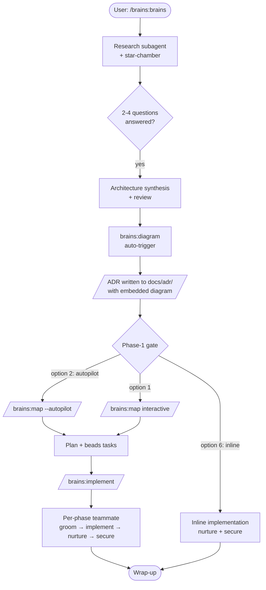
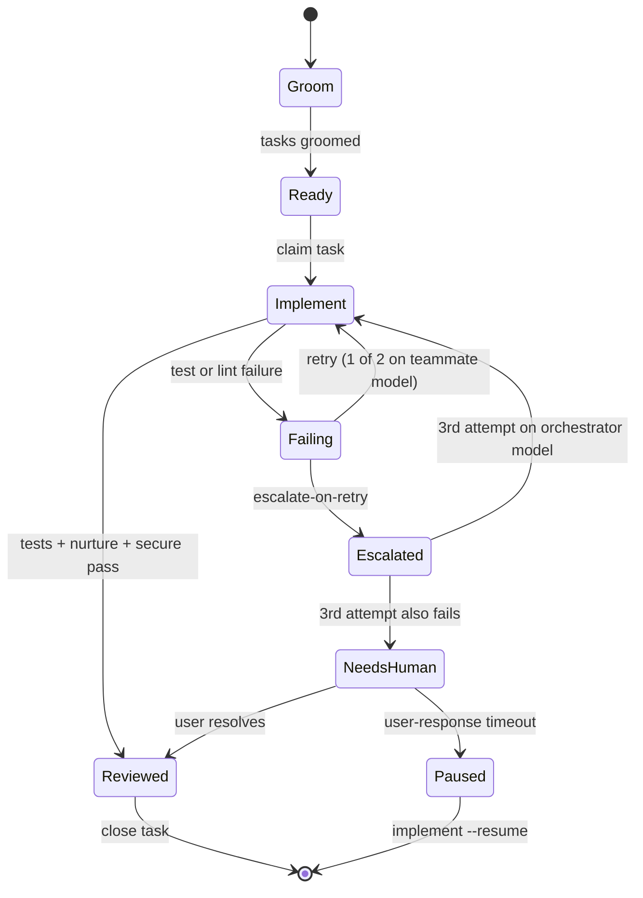
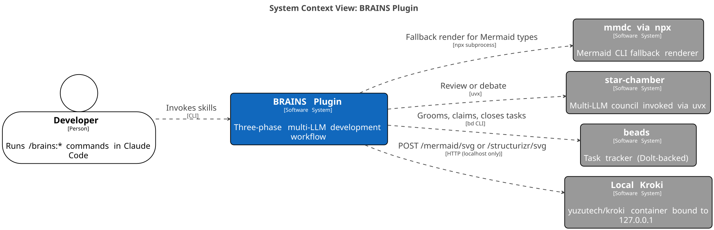
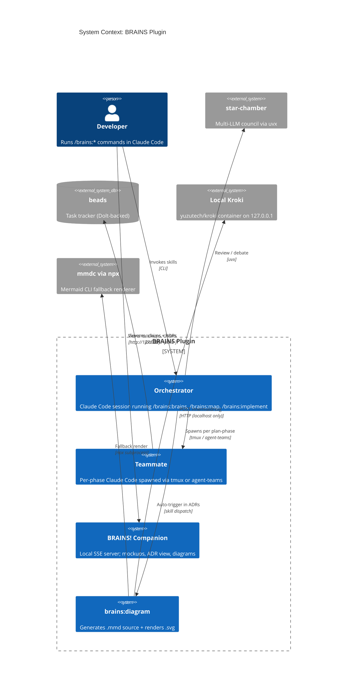

# Example Diagrams

This page showcases the three Mermaid diagram types `brains:diagram` can generate today (as of v0.4). Each example shows the **source** (`.mmd`) and the **rendered SVG** side-by-side — mirroring the on-disk layout the skill produces under `docs/adr/diagrams/`.

All three SVGs on this page were rendered by a local Kroki container (`yuzutech/kroki` + `yuzutech/kroki-mermaid`, bound to `127.0.0.1:8100`), which is the default renderer after `/brains:setup --with-kroki`. The same source files will produce equivalent output from the `mmdc` fallback.

Diagram source lives at [docs/diagrams/](diagrams/) alongside its rendered SVG — the same convention `brains:diagram` uses under `docs/adr/diagrams/`. The `.mmd` is canonical; the `.svg` is a derived artifact.

---

## Flowchart (`--type flowchart`)

End-to-end BRAINS pipeline with autopilot chaining and the inline-implementation shortcut.



<details><summary>Mermaid source — <code>pipeline-flowchart.mmd</code></summary>



</details>

**Reproduce:**

```bash
/brains:diagram "BRAINS pipeline from /brains:brains through wrap-up, including autopilot and inline-implement shortcut" --type flowchart
```

---

## State machine (`--type state`)

Teammate task lifecycle inside `/brains:implement`, showing the escalate-on-retry path (enabled by default in v0.3) and the paused/resume states.



<details><summary>Mermaid source — <code>teammate-state.mmd</code></summary>



</details>

**Reproduce:**

```bash
/brains:diagram "teammate task lifecycle with escalate-on-retry and paused/resume" --type state
```

> **Tip:** Mermaid's `stateDiagram-v2` treats `:` as the transition-label separator. Don't use `:` inside label text — that's why the source above says `claim task` rather than `bd update --claim`.

---

## C4 context (`--type c4`)

System-context view of the BRAINS plugin — orchestrator, teammates, companion, diagram skill, and the external services each of them talks to.



<details><summary>Mermaid source — <code>system-c4.mmd</code></summary>



</details>

**Reproduce:**

```bash
/brains:diagram "BRAINS system context showing orchestrator, teammate, companion, diagram skill and external services" --type c4
```

---

## Rendering these yourself

The diagrams above are Mermaid sources. `brains:diagram` tries renderers in order and uses the first one that answers:

1. **Local Kroki** — `~/.config/brains/renderer.json` with `kroki_url` pointing to a local container. Preferred; enable with `/brains:setup --with-kroki`.
2. **`mmdc` via `npx`** — Mermaid CLI, downloaded on first use. Requires Node.js ≥ 18.19.
3. **Source-only** — `.mmd` written, no `.svg`. ADR gets an HTML hint telling the reader how to enable rendering.

`--kroki-cloud` opts into the public `https://kroki.io` service **interactively only** — it's never used as an automatic fallback and it's disallowed in auto-trigger mode.

To render the three examples on this page the same way they were produced, run a local Kroki + Mermaid companion pair (Kroki's Mermaid rendering lives in a separate container):

```bash
podman network create kroki-net
podman run --rm -d --network kroki-net \
  --name kroki-mermaid docker.io/yuzutech/kroki-mermaid:latest
podman run --rm -d --network kroki-net \
  -e KROKI_MERMAID_HOST=kroki-mermaid \
  -p 127.0.0.1:8100:8000 --name kroki docker.io/yuzutech/kroki:latest

for f in pipeline-flowchart teammate-state system-c4; do
  curl -sf -X POST -H 'Content-Type: text/plain' \
    --data-binary "@docs/diagrams/${f}.mmd" \
    http://127.0.0.1:8100/mermaid/svg -o "docs/diagrams/${f}.svg"
done

podman stop kroki kroki-mermaid
podman network rm kroki-net
```

For the in-skill flow (`/brains:setup --with-kroki`), the setup wizard runs the single-container image with defaults appropriate for the standard install — see [skills/setup/SKILL.md](../skills/setup/SKILL.md).

---

## Reserved for v0.5

- `--type er` — entity-relationship diagrams (auto-trigger heuristic: schema / table / relationship vocabulary)
- `--type sequence` — sequence diagrams (auto-trigger heuristic: request / call / message vocabulary)

Both types are documented in [ADR-002](adr/2026-04-23-002-brains-diagramming.md) and reserved in the priority ordering, but the reference pages and dispatcher wiring land in v0.5.
