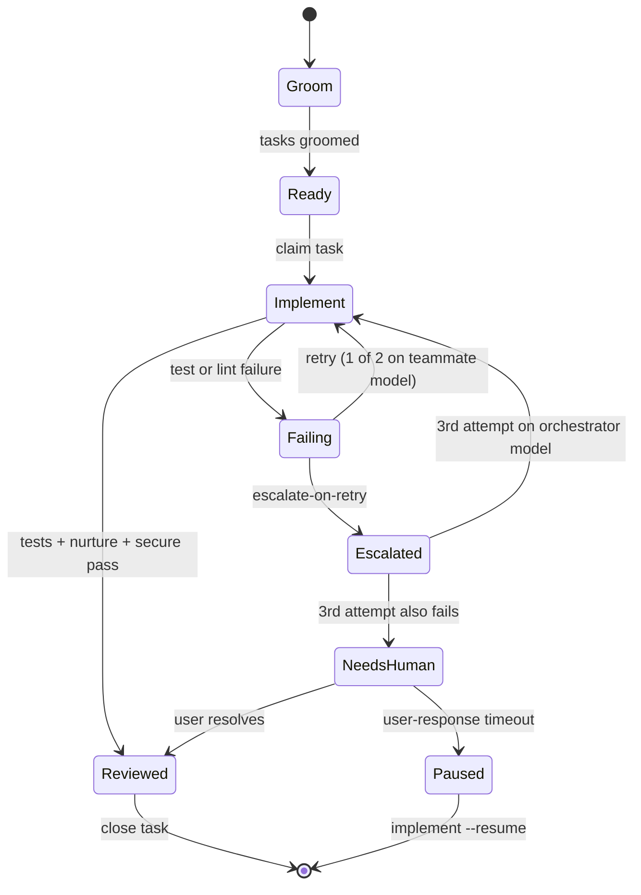
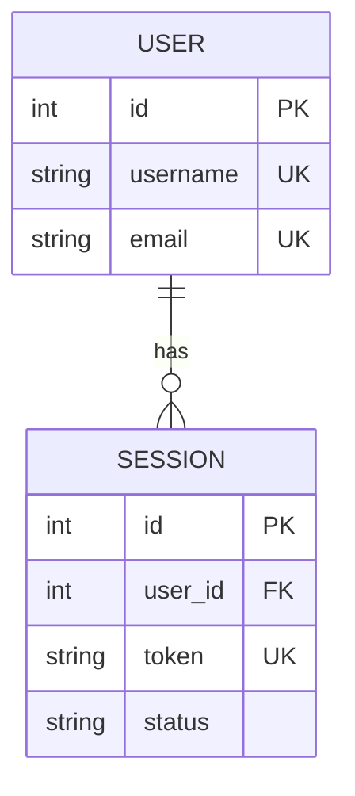
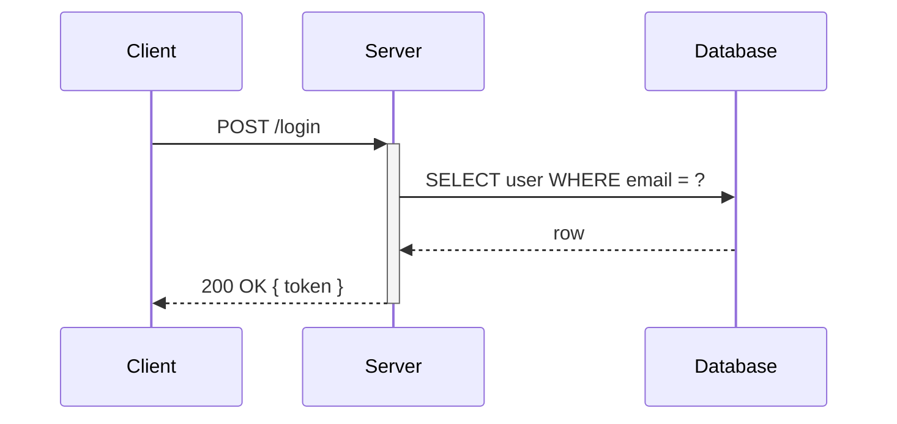

# Example Diagrams

This page showcases the five diagram types `brains:diagram` can generate (as of v0.5). Each example shows the **source** and the **rendered SVG** side-by-side — mirroring the on-disk layout the skill produces under `docs/adr/diagrams/`.

Two source languages are used: **Mermaid** (`.mmd`) for `flowchart` and `state`, and **Structurizr DSL** (`.dsl`) for `c4`. Structurizr is the canonical C4 modelling language; Kroki renders it via a bundled PlantUML backend that produces cleaner SVGs with explicit pixel dimensions than Mermaid's experimental C4 keyword.

All three SVGs on this page were rendered by a local Kroki gateway (`yuzutech/kroki` on `127.0.0.1:8100`), paired with the `yuzutech/kroki-mermaid` companion for Mermaid types. Structurizr rendering needs only the gateway — the Structurizr engine is bundled into the main image. This is the default renderer after `/brains:setup --with-kroki`. For Mermaid types, the `mmdc` fallback produces equivalent output.

Diagram source lives at [docs/diagrams/](diagrams/) alongside its rendered SVG — the same convention `brains:diagram` uses under `docs/adr/diagrams/`. The source file (`.mmd` or `.dsl`) is canonical; the `.svg` is a derived artifact.

---

## Flowchart (`--type flowchart`)

End-to-end BRAINS pipeline with autopilot chaining and the inline-implementation shortcut.


<details><summary>Mermaid source — <code>pipeline-flowchart.mmd</code></summary>


</details>

**Reproduce:**

```bash
/brains:diagram "BRAINS pipeline from /brains:brains through wrap-up, including autopilot and inline-implement shortcut" --type flowchart
```

---

## State machine (`--type state`)

Teammate task lifecycle inside `/brains:implement`, showing the escalate-on-retry path (enabled by default in v0.3) and the paused/resume states.


<details><summary>Mermaid source — <code>teammate-state.mmd</code></summary>



</details>

**Reproduce:**

```bash
/brains:diagram "teammate task lifecycle with escalate-on-retry and paused/resume" --type state
```

> **Tip:** Mermaid's `stateDiagram-v2` treats `:` as the transition-label separator. Don't use `:` inside label text — that's why the source above says `claim task` rather than `bd update --claim`.

---

## C4 context (`--type c4`) — Structurizr DSL

System-context view of the BRAINS plugin — orchestrator, teammates, companion, diagram skill, and the external services each of them talks to. Structurizr DSL is rendered by Kroki's bundled PlantUML/Structurizr backend; the output includes explicit pixel dimensions so it embeds cleanly in GitHub markdown.


<details><summary>Structurizr DSL source — <code>system-c4.dsl</code></summary>

```dsl
# auto-generated by brains:diagram — remove this line to protect manual edits
workspace "BRAINS" "System context for the BRAINS plugin" {

  model {
    dev = person "Developer" "Runs /brains:* commands in Claude Code"

    brains = softwareSystem "BRAINS Plugin" "Three-phase multi-LLM development workflow" {
      orch = container "Orchestrator" "Claude Code session running /brains:brains, /brains:map, /brains:implement"
      teammate = container "Teammate" "Per-phase Claude Code spawned via tmux or agent-teams"
      companion = container "BRAINS! Companion" "Local SSE server serving mockups, ADR view, diagrams"
      diagram = container "brains:diagram" "Generates Mermaid (.mmd) or Structurizr (.dsl) source and renders .svg"
    }

    starchamber = softwareSystem "star-chamber" "Multi-LLM council invoked via uvx" "External"
    beads = softwareSystem "beads" "Task tracker (Dolt-backed)" "External"
    kroki = softwareSystem "Local Kroki" "yuzutech/kroki container bound to 127.0.0.1" "External"
    mmdc = softwareSystem "mmdc via npx" "Mermaid CLI fallback renderer" "External"

    dev -> orch "Invokes skills" "CLI"
    dev -> companion "Views mockups and ADRs" "http://127.0.0.1:<port>"
    orch -> teammate "Spawns per plan-phase" "tmux / agent-teams"
    orch -> starchamber "Review or debate" "uvx"
    teammate -> beads "Grooms, claims, closes tasks" "bd CLI"
    orch -> diagram "Auto-trigger during ADR write" "skill dispatch"
    diagram -> kroki "POST /mermaid/svg or /structurizr/svg" "HTTP (localhost only)"
    diagram -> mmdc "Fallback render for Mermaid types" "npx subprocess"
  }

  views {
    systemContext brains "SystemContext" {
      include *
      autoLayout lr
    }

    container brains "Containers" {
      include *
      autoLayout lr
    }

    styles {
      element "External" {
        background #999999
        color #ffffff
      }
      element "Person" {
        shape person
      }
    }

    theme default
  }
}
```

</details>

**Reproduce:**

```bash
/brains:diagram "BRAINS system context showing orchestrator, teammate, companion, diagram skill and external services" --type c4
```

> **Why Structurizr and not Mermaid's `C4Context`?** Mermaid's C4 is experimental and emits SVGs without fixed `height` attributes, which many markdown renderers (including GitHub's) treat as zero-height and decline to display. Structurizr is the canonical C4 DSL and Kroki ships it bundled in the gateway image — no companion container needed — so `brains:diagram --type c4` standardizes on it. Mermaid remains the source language for `flowchart` and `state`.

---

## Rendering these yourself

`brains:diagram` tries renderers in order and uses the first one that answers:

1. **Local Kroki** — `~/.config/brains/renderer.json` with `kroki_url` pointing to a local container. Preferred; enable with `/brains:setup --with-kroki`. This is the only path that renders `c4` — `mmdc` cannot process Structurizr DSL.
2. **`mmdc` via `npx`** *(Mermaid types only)* — Mermaid CLI, downloaded on first use. Requires Node.js ≥ 18.19.
3. **Source-only** — source file written, no `.svg`. ADR gets an HTML hint telling the reader how to enable rendering.

`--kroki-cloud` opts into the public `https://kroki.io` service **interactively only** — it's never used as an automatic fallback and it's disallowed in auto-trigger mode.

To render all three examples on this page the same way they were produced, run the Kroki gateway with the Mermaid companion (Structurizr is bundled in the gateway itself, so no separate companion is needed):

```bash
podman network create kroki-net
podman run --rm -d --network kroki-net \
  --name kroki-mermaid docker.io/yuzutech/kroki-mermaid:latest
podman run --rm -d --network kroki-net \
  -e KROKI_MERMAID_HOST=kroki-mermaid \
  -p 127.0.0.1:8100:8000 --name kroki docker.io/yuzutech/kroki:latest

# Mermaid types
for f in pipeline-flowchart teammate-state; do
  curl -sf -X POST -H 'Content-Type: text/plain' \
    --data-binary "@docs/diagrams/${f}.mmd" \
    http://127.0.0.1:8100/mermaid/svg -o "docs/diagrams/${f}.svg"
done

# Structurizr DSL type
curl -sf -X POST -H 'Content-Type: text/plain' \
  --data-binary "@docs/diagrams/system-c4.dsl" \
  http://127.0.0.1:8100/structurizr/svg -o "docs/diagrams/system-c4.svg"

podman stop kroki kroki-mermaid
podman network rm kroki-net
```

The `/brains:setup --with-kroki` wizard automates the same two-container setup under the names `brains-kroki` and `brains-kroki-mermaid` on a shared user-defined network — see [skills/setup/SKILL.md](../skills/setup/SKILL.md).

---

## ER diagram (`--type er`)

Entity-relationship diagrams for architectures with ≥2 entities and ≥1 relationship. Auto-trigger priority: 2nd (after `state`, before `flowchart`). Soft cap: ≤10 entities — exceeded diagrams emit a `%% NOTE: exceeds SHOULD cap` warning on line 2.

**Example source:**



**Reproduce:**

```bash
/brains:diagram "users with sessions" --type er
```

See [`skills/diagram/references/er.md`](../skills/diagram/references/er.md) for syntax reference and pitfalls.

---

## Sequence diagram (`--type sequence`)

Sequence diagrams for architectures with ≥2 named participants and ≥3 ordered message exchanges. Auto-trigger priority: lowest (after `c4`). Linear event narratives without named senders/receivers fall through to `flowchart`. Soft cap: ≤6 participants — exceeded diagrams emit a `%% NOTE: exceeds SHOULD cap` warning on line 2.

**Example source:**



**Reproduce:**

```bash
/brains:diagram "login flow: client posts credentials, server queries DB, returns token" --type sequence
```

See [`skills/diagram/references/sequence.md`](../skills/diagram/references/sequence.md) for syntax reference and pitfalls.
