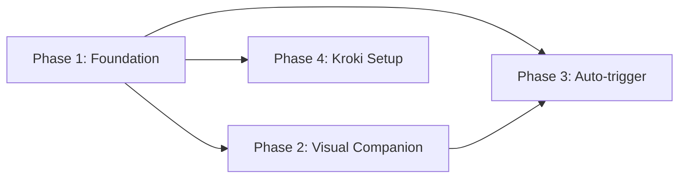

# Plan: BRAINS Diagramming Feature

**Slug:** brains-diagramming
**ADRs:** docs/adr/2026-04-23-002-brains-diagramming.md
**Research:** docs/plans/2026-04-23-brains-diagramming-research.md
**Mode:** --parallel
**Autopilot:** true
**Lean:** false
**Branch:** brains/brains-diagramming

## Overview

This plan implements the BRAINS diagramming feature as specified in ADR-002. It ships a single new `brains:diagram` skill with per-type lazy-on-demand reference files (flowchart, state, C4), a renderer pipeline that checks a local Kroki container first then `mmdc` via npx then falls back to source-only, storage conventions placing `.mmd` source and `.svg` output side-by-side in `docs/adr/diagrams/`, a Mermaid retry-and-placeholder self-correction loop, an auto-trigger heuristic wired into phase-1 step 8, a rebranded visual companion with Mermaid CDN rendering, `BRAINS.gif` loader, zombie working sprites, DOMPurify-sanitized ADR display at the gate, and an optional `brains:setup --with-kroki` step that pulls and runs the official `yuzutech/kroki` container via podman or docker.

## Plan-phases

### Phase 1: Diagram Skill Foundation

Scaffold the `brains:diagram` skill, renderer detection logic, storage conventions, self-correction loop, adr-template update, and token-efficiency constraints — no visual companion work, no phase-1 integration yet.

- **Task 1.1** — Scaffold the `brains:diagram` skill directory and SKILL.md
  - Description: Create `skills/diagram/SKILL.md` as the single entry point for ad-hoc and ADR-triggered diagram generation; define the skill header (name, description, argument-hint, allowed-tools) and the top-level routing table that dispatches to per-type reference files based on `--type`.
  - Acceptance:
    - `/brains:diagram "description" --type flowchart` is a valid invocation recognized by the skill header.
    - SKILL.md is under 4 KB as measured by `wc -c`.
    - The routing table references `flowchart.md`, `state.md`, and `c4.md` as lazy-on-demand entries with no other types listed.
  - Dependencies: (none)

- **Task 1.2** — Author per-type reference files: flowchart.md, state.md, c4.md
  - Description: Write three reference files under `skills/diagram/references/` — one per v0.4 diagram type — each containing Claude prompt guidance specific to that type (node/edge conventions, Mermaid syntax tips, layout hints, common mistakes).
  - Acceptance:
    - Each file is under 3 KB (`wc -c`).
    - Each file covers at minimum: recommended Mermaid syntax for the type, 2-3 common pitfalls Claude should avoid, and an example skeleton.
    - Files are declared `lazy-on-demand` in the phase-1 role manifest with trigger condition "diagram of this type is being generated".
  - Dependencies: 1.1

- **Task 1.3** — Implement renderer detection and priority logic
  - Description: Author `skills/diagram/references/renderer-conventions.md` describing the renderer detection sequence: (1) read `~/.config/brains/renderer.json` for `kroki_url` and POST Mermaid source to `${kroki_url}/mermaid/svg`; (2) attempt `npx -p @mermaid-js/mermaid-cli mmdc` if `kroki_url` absent or unavailable; (3) fall back to source-only. Document the `--kroki-cloud` explicit-consent path as a separate named option that must be re-confirmed each invocation.
  - Acceptance:
    - When `renderer.json` exists with a valid `kroki_url`, the skill instructs the model to use Kroki; otherwise mmdc is attempted first before source-only.
    - The `--kroki-cloud` flag path is documented with the consent requirement stated explicitly (not implied).
    - No diagram source is ever sent to an external cloud service without `--kroki-cloud` present in the invocation.
  - Dependencies: 1.1
  - **Risk:** medium — renderer detection order and fallback handling must be unambiguous enough that a model executing the skill never silently sends source to Kroki.io.

- **Task 1.4** — Define storage conventions and ADR `## Diagram` section format
  - Description: Document in `skills/diagram/references/storage-conventions.md` the canonical naming pattern (`docs/adr/diagrams/<adr-filename-stem>-<type>.mmd` and `.svg`), the exact ADR section format (SVG image reference when SVG exists + collapsed `
` Mermaid block always present + HTML comment hint when no renderer), and the rule that `.mmd` is canonical and `.svg` is a derived artifact.
  - Acceptance:
    - The storage-conventions reference specifies the exact filename stem derivation rule (from the ADR filename, not the title).
    - The ADR section format shows both the with-SVG and source-only variants verbatim.
    - The HTML renderer-hint comment text is specified (one-line, references `--with-kroki` and `mmdc`).
  - Dependencies: 1.1

- **Task 1.5** — Implement self-correction and regeneration rules
  - Description: Add a self-correction section to `skills/diagram/SKILL.md` specifying the retry-once loop (append renderer error message to context on first failure), the minimal placeholder diagram written on second failure (single-node `flowchart TD` with a comment noting manual revision), atomic overwrite semantics for regeneration (overwrite both `.mmd` and `.svg` together, never leave a stale `.svg` without a corresponding `.mmd`), and the rule that option-5 re-runs trigger regeneration of all existing auto-triggered diagrams for the ADR.
  - Acceptance:
    - The retry loop is described as exactly one retry, not open-ended.
    - The placeholder diagram content is specified verbatim (or as a template) so all implementations produce the same fallback.
    - Atomic overwrite rule explicitly prohibits leaving orphan `.svg` files.
  - Dependencies: 1.1, 1.4

- **Task 1.6** — Update adr-template.md and phase-1 manifest
  - Description: Extend `skills/brains/references/adr-template.md` to replace the current freeform `## Diagram` comment with the exact ADR section format from Task 1.4 (SVG image reference + `
` block + HTML comment when no renderer). Update `manifests/phase-1-brains.md` to declare `skills/diagram/references/flowchart.md`, `state.md`, `c4.md`, `storage-conventions.md`, and `renderer-conventions.md` as `lazy-on-demand` entries.
  - Acceptance:
    - The updated `## Diagram` section in `adr-template.md` shows both the with-SVG and source-only variants clearly delimited by a condition comment.
    - All five new reference files appear in `manifests/phase-1-brains.md` with `lazy-on-demand` and an `on-demand-trigger` of "diagram generation".
    - The phase-1 manifest does not grow beyond its current line count by more than the lines added for these five entries.
  - Dependencies: 1.4, 1.2, 1.3

### Phase 2: Visual Companion Upgrades

Rebrand `frame-template.html` to "BRAINS!", add Mermaid CDN rendering, BRAINS.gif static asset and loader overlay, vendored zombie working sprites, ADR scrollable view at the gate, and all required security/accessibility hardening.

- **Task 2.1** — Rebrand frame-template.html: header, title, and link
  - Description: In `skills/brains/scripts/frame-template.html`, change the `<title>` element to "BRAINS!", replace the header `<h1>` text "Superpowers Brainstorming" with "BRAINS!" (exclamation included), and make it an `<a>` linking to `https://github.com/Epiphytic/brains` with `target="_blank" rel="noopener"`.
  - Acceptance:
    - `<title>` reads exactly "BRAINS!".
    - The header link href is exactly `https://github.com/Epiphytic/brains` and opens in a new tab with `rel="noopener"`.
    - The header `<a>` inherits the existing header h1 color styles (`color: inherit; text-decoration: none`) so visual appearance is unchanged except for the text and link target.
  - Dependencies: (none)

- **Task 2.2** — Add Mermaid ESM CDN import and live rendering support
  - Description: Add a `` produces no alert when rendered.
    - DOMPurify's SVG profile is explicitly enabled so Mermaid SVG in Task 2.6b is not stripped.
  - Dependencies: 2.2
  - **Risk:** high — DOMPurify + marked is a new XSS surface. Implementor MUST test with adversarial input before marking complete.

- **Task 2.6b** — Live Mermaid rendering with per-block try/catch error boundaries
  - Description: In the ADR view, place each `## Diagram` section's Mermaid source block into a `<pre class="mermaid">` element so the Mermaid CDN (Task 2.2) renders it live. Each Mermaid block MUST be rendered inside a try/catch (using `mermaid.render()` with a unique id per block rather than relying solely on `startOnLoad`); a parse failure on one block MUST NOT halt rendering of the rest of the ADR view. Failed blocks display the raw source in a `<pre>` with a red-bordered error message showing the parse error.
  - Acceptance:
    - An ADR containing two diagram blocks where the first has a syntax error still renders the second block correctly.
    - The failed block shows its raw source plus the error text in a visually-distinct error container.
    - No global `window.onerror` handler is used for Mermaid failures — all catches are scoped per block.
  - Dependencies: 2.2, 2.6a
  - **Risk:** medium — Mermaid async rendering semantics; implementor should verify behavior across both parse-error and layout-error failure modes.

- **Task 2.7** — Update visual-companion.md reference for diagram-capable fragments
  - Description: Add a short section to `skills/brains/references/visual-companion.md` documenting that content fragments may include `<pre class="mermaid">` blocks (rendered live by the CDN), `.zombie-working` containers for processing screens, and the ADR gate view structure. Also update the companion offer text in the brains SKILL.md step 4 to explicitly mention architecture diagrams (this is a one-sentence addition to the existing offer prompt).
  - Acceptance:
    - `visual-companion.md` includes at least one example of a `<pre class="mermaid">` fragment.
    - The step 4 offer text in `skills/brains/SKILL.md` mentions "architecture diagrams" in addition to the existing list.
    - Net line growth in `skills/brains/SKILL.md` for this change is ≤ 3 lines.
  - Dependencies: 2.2, 2.5, 2.6a, 2.6b

### Phase 3: Auto-trigger Integration

Wire `brains:diagram` into phase-1 step 8 heuristics, add the `--max-diagrams`/`--no-diagram`/`--diagram` flag handling, and connect regeneration on option 5 — completing the end-to-end ADR-to-diagram flow.

- **Task 3.1** — Add step 8 auto-trigger heuristics to brains SKILL.md
  - Description: Extend step 8 (ADR generation) in `skills/brains/SKILL.md` to evaluate the synthesized architecture against the three heuristics (state, ER, flowchart in priority order) and dispatch to `brains:diagram` when exactly one fires (or the highest-priority match when multiple fire). The new step 8 text must describe the priority order, the heuristic thresholds, and the single-dispatch rule.
  - Acceptance:
    - Step 8 specifies all three heuristics with the exact threshold conditions from the ADR (not paraphrased).
    - Priority order state > ER > flowchart is stated explicitly.
    - The dispatch calls `brains:diagram` as a sub-skill invocation with the derived type and the ADR slug as context.
    - Net line growth in `skills/brains/SKILL.md` for steps 4 and 8 combined is ≤ 40 lines (ADR requirement).
  - Dependencies: 1.1, 1.6

- **Task 3.2** — Add `--max-diagrams`, `--no-diagram`, and `--diagram` flag handling
  - Description: Add parsing of `--max-diagrams N` (1-5, default 1), `--no-diagram`, and `--diagram <type>` to the brains SKILL.md step 1 argument parsing section. Document the precedence rules: `--no-diagram` suppresses all auto-trigger; `--diagram <type>` forces that type and overrides `--max-diagrams`; `--max-diagrams N` with N>1 allows up to one diagram per firing heuristic in the full priority order **state > ER > flowchart > C4 > sequence** (sequence is v0.5 but must appear in the priority specification now to avoid rework).
  - Acceptance:
    - `--no-diagram` suppresses any auto-trigger; no diagram skill is invoked.
    - `--diagram flowchart` generates exactly one flowchart diagram regardless of heuristic outcome.
    - `--max-diagrams 3` allows up to three diagrams in the order state > ER > flowchart > C4 (v0.4 types only; sequence tier is documented but inactive until v0.5).
    - `--max-diagrams 5` is the maximum permitted N; parse errors if N > 5 or N < 1.
    - Argument parsing additions appear in step 1 of SKILL.md; net line growth counted within the 40-line budget in Task 3.1.
  - Dependencies: 3.1

- **Task 3.3** — Connect ADR display to gate (step 9 visual companion push)
  - Description: Extend step 9 of `skills/brains/SKILL.md` to push the ADR gate view (from Task 2.6) to the visual companion when the companion is active, using the existing `screen_dir` write pattern. The ADR view must remain visible (not overwritten by a waiting screen) while the user evaluates gate options 1-6.
  - Acceptance:
    - When the companion is active, step 9 writes an ADR view HTML file to `screen_dir` before presenting the gate prompt in the terminal.
    - The waiting-screen write (used elsewhere to signal Claude is idle) is not called until after the user responds to the gate.
    - The companion view includes filename, status badge, and full rendered body for each ADR produced in the current run.
  - Dependencies: 2.6, 3.1

- **Task 3.4** — Wire option-5 re-run to diagram regeneration
  - Description: In `skills/brains/SKILL.md` option-5 handling, after the revised ADR is produced, add a step that enumerates `docs/adr/diagrams/` for any `.mmd` files whose stem matches the current ADR filename-stem (anchored match — `<adr-stem>-<type>.mmd`, NOT wildcard globs that could match unrelated files) and re-invokes `brains:diagram` to regenerate them from the updated architecture. The "atomic overwrite" rule means `.mmd` is written first, then `.svg`; if `.svg` write fails, the stale `.svg` from the prior generation MUST be unlinked so no orphan exists. Regeneration acts on one file at a time, not via shell glob expansion.
  - Acceptance:
    - Option-5 handling explicitly lists "regenerate diagrams" as a step after revised ADR production.
    - The regeneration step specifies per-type enumeration (state, ER, flowchart, C4), NOT a wildcard glob.
    - The atomic overwrite contract is stated: `.mmd` written first, `.svg` written second, orphan `.svg` removed on write failure.
    - Regeneration SKIPS diagrams the user manually authored outside auto-trigger (determined by absence of a matching `brains:diagram` invocation record; if no such record exists, regeneration is SKIPPED and a one-line note logged).
  - Dependencies: 1.5, 3.1
  - **Risk:** medium — atomic overwrite semantics and filename-stem anchoring must be precise; a shell-glob implementation would risk matching user-authored or unrelated files.

### Phase 4: Kroki Container Setup

Add `brains:setup --with-kroki` and `--without-kroki` optional steps, podman/docker detection, `renderer.json` read/write contract, and the argument-hint update.

- **Task 4.1** — Implement `brains:setup --with-kroki` step
  - Description: Add a new conditional setup step to `skills/setup/SKILL.md` triggered by `--with-kroki` that: (1) detects `podman` first, falls back to `docker`, errors and exits non-zero if neither is found without modifying any system state; (2) pulls `yuzutech/kroki:latest`; (3) runs the container with a user-configurable port (default 8000) and `--restart=unless-stopped` (or equivalent for the detected runtime); (4) writes `~/.config/brains/renderer.json` with `kroki_url`, `kroki_runtime`, and `kroki_started_at` (ISO-8601).
  - Acceptance:
    - When neither podman nor docker is found, setup exits non-zero and `renderer.json` is not created or modified.
    - `renderer.json` contains exactly the three fields specified; no other fields are written.
    - The port is configurable (user can pass `--port N`); default is 8000.
  - Dependencies: (none)
  - **Risk:** medium — container lifecycle management (detecting if the container is already running before pulling/starting) requires idempotent logic; a second `--with-kroki` run must not create a duplicate container.

- **Task 4.2** — Implement `brains:setup --without-kroki` teardown step
  - Description: Add the reverse operation to `skills/setup/SKILL.md`: detect the runtime from `renderer.json`, stop and remove the `yuzutech/kroki` container, and delete the Kroki-specific fields (`kroki_url`, `kroki_runtime`, `kroki_started_at`) from `renderer.json` — or delete the file entirely if those are its only fields. Document that `--with-kroki` and `--without-kroki` are the ONLY mechanisms permitted to modify `renderer.json`; no other BRAINS skill writes or deletes this file.
  - Acceptance:
    - After `--without-kroki`, the container is stopped and removed (not just stopped).
    - `renderer.json` no longer contains any `kroki_*` keys after teardown.
    - If `renderer.json` did not exist or had no Kroki entries, the step is a no-op that exits zero.
    - `renderer-conventions.md` (Task 1.3) includes an "immutability rule" paragraph stating no skill other than `brains:setup` writes `renderer.json`.
  - Dependencies: 4.1, 1.3

- **Task 4.3** — Update setup SKILL.md argument-hint and help text
  - Description: Update the `argument-hint` in `skills/setup/SKILL.md` to include `[--with-kroki [--port N]] [--without-kroki]`, and add a one-paragraph description of the Kroki setup step to the Setup skill's opening help text so users discover it.
  - Acceptance:
    - `argument-hint` in the YAML header includes `--with-kroki` and `--without-kroki`.
    - The help text accurately states: local Kroki becomes the primary renderer; mmdc is the fallback; no diagram source is sent to Kroki.io without `--kroki-cloud`.
    - Net line growth in `skills/setup/SKILL.md` is ≤ 60 lines for Tasks 4.1–4.3 combined.
  - Dependencies: 4.1, 4.2

## Phase dependency graph

Phase 2 and Phase 4 can proceed in parallel once Phase 1 is complete. Phase 3 requires both Phase 1 and Phase 2 (Task 2.6 must exist before Task 3.3 can reference the ADR view).

## Out of scope for v0.4

`sequence.md` and `er.md` per-type reference files are deferred to v0.5. Adding them is purely additive: one new reference file per type, one new row in the `brains:diagram` router table, one new heuristic threshold in step 8. No architectural changes required.

## Star-chamber round-3 tightening (auto-integrated)

Applied in this revision:
- **Task 2.6 split** into 2.6a (Markdown + DOMPurify, with explicit SVG profile config) and 2.6b (per-block Mermaid try/catch). Too much surface for one teammate session.
- **Task 3.2 priority order** now lists the full chain `state > ER > flowchart > C4 > sequence` (C4 was missing despite being a v0.4 type). Parse errors on N out of range explicitly covered.
- **Task 3.4 risk-flagged medium** and acceptance criteria tightened: per-type enumeration (not wildcard globs), anchored filename-stem matching, explicit orphan-`.svg` removal on failure, skip-if-user-authored rule.
- **Task 4.2 renderer.json immutability** enforced via cross-reference to `renderer-conventions.md` (Task 1.3) — no other skill writes this file.

Not applied: star-chamber split-vote on merging Phase 4 into Phase 1. Consensus "keep phasing with targeted fixes" (Approach 3, excellent fit) won over "merge" (Approach 4, good fit). Phase 4 remains independent and parallel-able with Phase 2.

## Open questions flagged during planning

1. **BRAINS.gif source availability** — Task 2.3 requires a 3.6 MB source gif at `~/Downloads/BRAINS.gif` (or equivalent); if unavailable the task is blocked.
2. **Zombie sprite sourcing** — Task 2.5 recommends openmoji (CC0) as a concrete starting point; otherwise hand-authored SVG/CSS.
3. **DOMPurify + Mermaid SVG interaction (Task 2.6, risk-high)** — implementor must configure DOMPurify with `USE_PROFILES: { svg: true, svgFilters: true }` or equivalent so Mermaid's SVG output isn't stripped.
4. **`renderer.json` schema versioning** — forward-compatibility concern for later Kroki schema evolution; not a v0.4 blocker.
