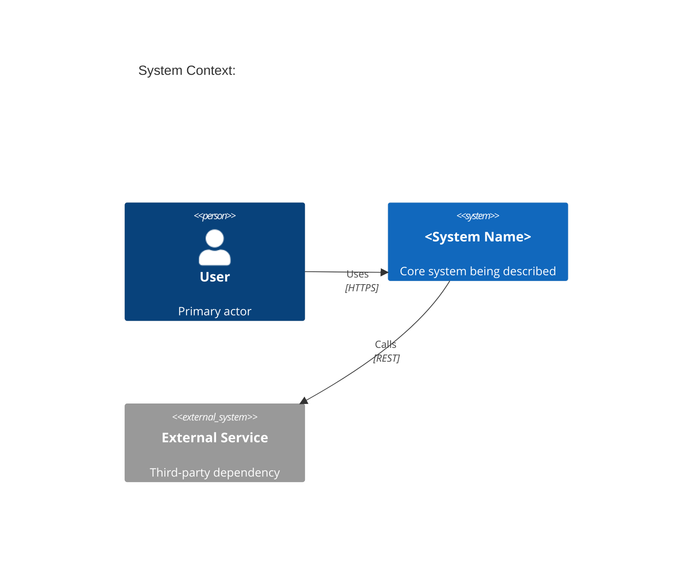

# C4 Diagram Reference

Mermaid supports C4 Context and Container diagrams via the `C4Context` and `C4Container` keywords. Use `C4Context` for high-level system-context views (system + actors) and `C4Container` for container-level views (services, databases, frontends within a system boundary).

## Mermaid Syntax

```
C4Context
    title System Context: Payment Service

    Person(user, "Customer", "Places orders")
    Person_Ext(admin, "Admin", "Manages catalogue")

    System(paymentSvc, "Payment Service", "Handles transactions")
    System_Ext(stripe, "Stripe", "Payment gateway")
    SystemDb(orderDb, "Order DB", "Stores orders")

    Rel(user, paymentSvc, "Submits payment", "HTTPS")
    Rel(paymentSvc, stripe, "Charges card", "REST")
    Rel(paymentSvc, orderDb, "Reads/writes orders", "SQL")
    Rel(admin, paymentSvc, "Manages", "HTTPS")
```

Key elements:
- `Person(id, label, description)` internal person/actor
- `Person_Ext(...)` external person
- `System(...)` internal system
- `System_Ext(...)` external system
- `SystemDb(...)` database
- `Container(id, label, tech, description)` C4Container only
- `Rel(from, to, label[, tech])` relationship
- `Boundary(id, label) { ... }` group elements in a boundary box

## Common Pitfalls

1. **Missing `title` causes unlabelled diagrams.** Always include a `title` line immediately after the diagram type keyword.

2. **Mixing C4Context and C4Container elements.** `Container()` is only valid inside `C4Container`; using it in `C4Context` produces parse errors. Start with `C4Context` for system-level, promote to `C4Container` when drilling into one system.

3. **Too many elements in one diagram.** C4 diagrams degrade quickly above 8-10 elements. Split into separate context and container diagrams rather than cramming all services into one view.

## Skeleton


