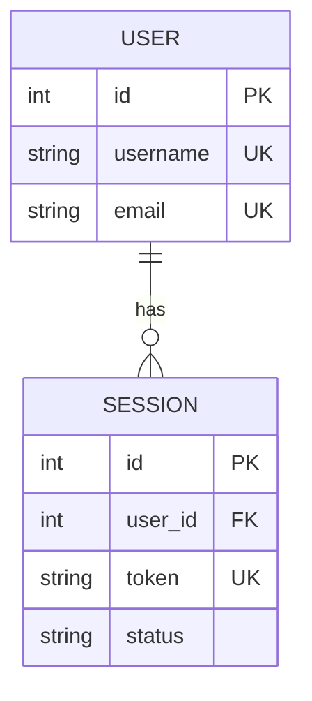

# ER Diagram Reference

Use `erDiagram` for entity-relationship diagrams. Crow's-foot cardinality notation is required for all relationships. Attribute blocks are optional — bare entity names are valid. Default orientation is TB; add `LR` after `erDiagram` for left-to-right layouts.

## Mermaid Syntax

```
erDiagram
    CUSTOMER {
        int id PK
        string name
        string email UK
    }
    ORDER {
        int id PK
        int customer_id FK
        string status
    }
    PRODUCT {
        int id PK
        string name
        decimal price
    }
    ORDER_ITEM {
        int order_id FK
        int product_id FK
        int quantity
    }
    CUSTOMER ||--o{ ORDER : "places"
    ORDER ||--|{ ORDER_ITEM : "contains"
    PRODUCT ||--o{ ORDER_ITEM : "included in"
```

Cardinality symbols (crow's-foot):

| Symbol | Meaning |
|---|---|
| `\|\|--\|\|` | exactly one to exactly one |
| `\|\|--o{` | one to zero-or-more |
| `\|\|--\|{` | one to one-or-more |
| `\|o--o{` | zero-or-one to zero-or-more |
| `}o--o{` | zero-or-more to zero-or-more |

Identifying relationship: `--` (solid line). Non-identifying: `..` (dashed line).

Attribute syntax: `type name [PK|FK|UK] ["comment"]` per line. Multiple key markers are comma-separated: `int id PK, FK`.

## Common Pitfalls

1. **Parameterized types break the parser.** `varchar(255)` and `decimal(10,2)` are not valid. Use bare type names: `varchar255`, `string`, `decimal`.

2. **Reserved-keyword relationship labels must be quoted.** `to`, `from`, and similar verb tokens are parser keywords. Always quote labels: `CUSTOMER ||--o{ ORDER : "places"` — not `: places`.

3. **Alias notation with spaces before `--` or `..` fails in Mermaid ≥ 11.13 (issue #7482).** The form `A 1 -- 1+ B : label` is rejected. Use standard crow's-foot notation without aliases — it is unaffected and preferred.

4. **Attribute names starting with a digit are invalid.** `bool 2fa_enabled` fails at parse time. Use `bool twofa_enabled` instead.

5. **More than 10 entities causes cardinality-circle rendering breakdowns (issues #4342, #8153).** The `o` circle floats off relationship lines in wide diagrams. SHOULD: keep auto-generated ER diagrams to ≤ 10 entities. When the synthesizer determines the architecture exceeds this cap, emit the diagram with the following warning as the **second line** of the source file (after the auto-trigger marker on line 1): `%% NOTE: exceeds SHOULD cap of N entities; consider splitting` — where `N` is the actual entity count. Do NOT silently truncate or refuse to generate.

## Skeleton


