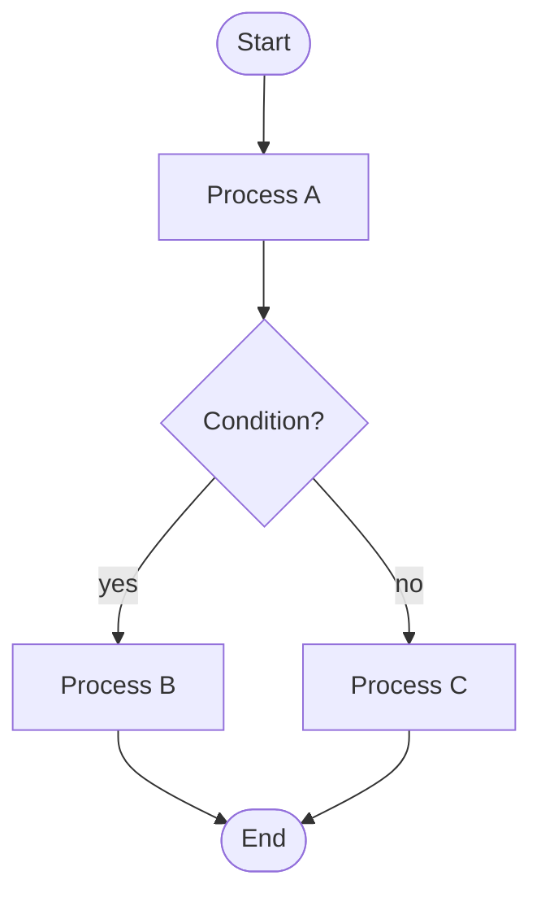

# Flowchart Diagram Reference

Use `flowchart TD` (top-down) as the default orientation. Use `flowchart LR` (left-right) only when the diagram has more than 4 parallel horizontal lanes.

## Mermaid Syntax

```
flowchart TD
    A[Rectangular node] --> B{Diamond decision}
    B -->|yes| C([Rounded: start/end])
    B -->|no| D[(Database)]
    D --> E[/Parallelogram: I/O/]
    subgraph GroupLabel
        F --> G
    end
    A --> F
```

Node shapes:
- `[text]` rectangle (process)
- `{text}` diamond (decision)
- `([text])` stadium (start/end terminal)
- `[(text)]` cylinder (database/store)
- `[/text/]` parallelogram (I/O)

Edge types: `-->` arrow, `---` line, `-.->` dashed, `==>` thick, `-->|label|` labelled

## Common Pitfalls

1. **Special characters in labels break parsing.** Wrap label text containing `(`, `)`, `{`, `}`, `"`, or `:` in double quotes: `A["Label with (parens)"]`.

2. **Subgraph IDs conflict with node IDs.** Give subgraphs unique IDs distinct from any node ID: `subgraph sg1["Human-readable title"]`.

3. **Deeply nested subgraphs become unreadable.** Limit nesting to 2 levels; flatten deeper hierarchies into separate diagrams.

## Skeleton


