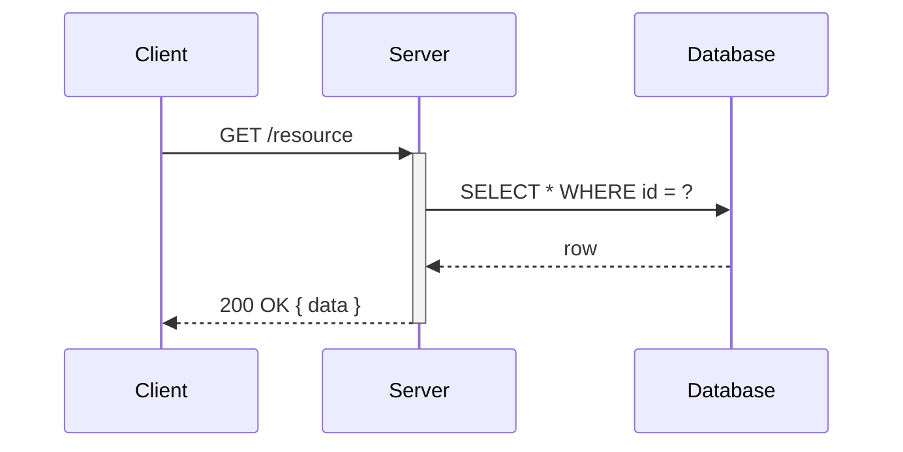

# Sequence Diagram Reference

Use `sequenceDiagram` for message-passing protocols between named participants. Declare all participants explicitly at the top — Mermaid infers order-of-first-mention for undeclared names, producing unpredictable layouts. Use `participant` (rectangle) for systems/services; `actor` (stick figure) for humans. Limit output to these two shapes; other shapes render poorly across themes.

**Auto-trigger heuristic:** the decision describes ≥2 named participants AND ≥3 ordered message exchanges (request/response, call/return, publish/subscribe, or sequential event steps) between them. Linear event narratives without named senders and receivers fall through to `flowchart`.

## Mermaid Syntax

```
sequenceDiagram
    participant C as Client
    participant S as Server
    participant DB as Database

    C->>+S: POST /login
    S->>DB: SELECT user WHERE email = ?
    DB-->>S: row
    S-->>-C: 200 OK { token }
```

Arrow types: `A->>B: msg` (call), `A-->>B: msg` (return), `A-xB: msg` (fire-and-forget), `A-)B: msg` (async), `A--)B: msg` (async return). Convention: `->>` for calls, `-->>` for responses.

Activation shorthand (preferred — couples activation to its arrow, reducing mismatch errors): `A->>+B: req` / `B-->>-A: resp`. Use explicit `activate`/`deactivate` only for stacked activations.

Control-flow blocks (all close with `end`): `loop`, `alt ... else`, `opt`, `par ... and`, `critical ... option`, `break`.

**Soft cap:** SHOULD keep auto-generated sequence diagrams to ≤ 6 participants. When the cap is exceeded, emit the diagram with this warning as line 2 (after the auto-trigger marker): `%% NOTE: exceeds SHOULD cap of N participants; consider splitting`. Do NOT silently truncate or refuse to generate.

## Common Pitfalls

1. **Implicit participant ordering produces unpredictable layouts.** Declare every `participant` or `actor` line before the first message line.

2. **Mismatched activate/deactivate pairs cause rendering errors.** Use inline `+/-` shorthand (`A->>+B:`, `B-->>-A:`) by default; reserve explicit `activate`/`deactivate` blocks for stacked activations where the shorthand cannot be nested.

3. **`end` inside an unquoted message label silently closes the current control-flow block.** `S->>C: session end` is parsed as closing a block. Quote the label: `S->>C: "session end"`.

4. **Arrow direction reversal.** The left side of an arrow is always the sender. State sender→receiver convention explicitly in generation context to prevent accidental reversal.

5. **Colon in an unquoted label truncates the message.** `:` separates the arrow from its label, so `C->>S: POST /api: body` renders as `POST /api`. Quote labels containing colons: `C->>S: "POST /api: body"`.

## Skeleton


