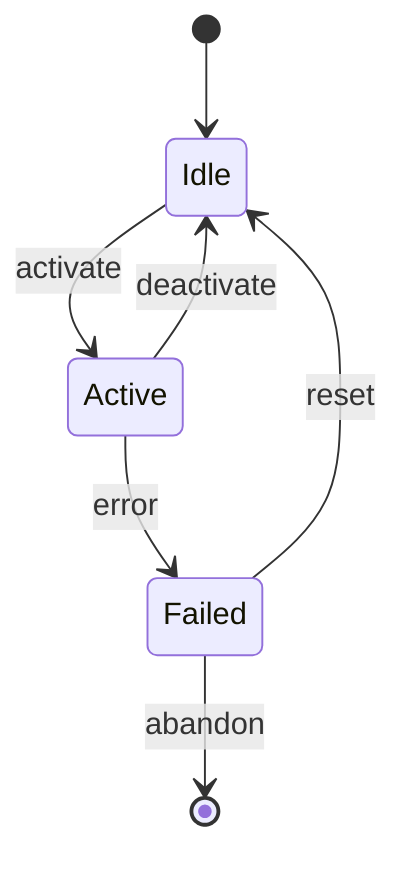

# State Diagram Reference

Use `stateDiagram-v2` (not the deprecated `stateDiagram`). Always include `[*]` as the initial and final state.

## Mermaid Syntax

```
stateDiagram-v2
    [*] --> Idle
    Idle --> Processing : start
    Processing --> Idle : complete
    Processing --> Error : failure
    Error --> Idle : retry
    Error --> [*] : abort

    state Processing {
        [*] --> Fetching
        Fetching --> Transforming : data received
        Transforming --> [*]
    }

    note right of Error
        Logged to audit trail
    end note
```

Key syntax:
- `[*]` entry/exit pseudo-state
- `StateA --> StateB : label` transition with trigger label
- `state Name { ... }` composite/nested state
- `note right of StateName\n...\nend note` annotations
- `--` concurrent regions separator inside a composite state

## Common Pitfalls

1. **Omitting [*] causes invalid diagrams.** Every `stateDiagram-v2` MUST have at least one `[*] --> InitialState` entry and at least one `FinalState --> [*]` exit transition.

2. **Bare whitespace in state names.** Use underscores or CamelCase for state identifiers; use string aliases for display: `WaitingForUser: Waiting for User`.

3. **Deeply nested concurrent states.** Mermaid renders `--` concurrent regions poorly beyond 2 concurrent paths; prefer separate diagrams for complex concurrency.

## Skeleton


